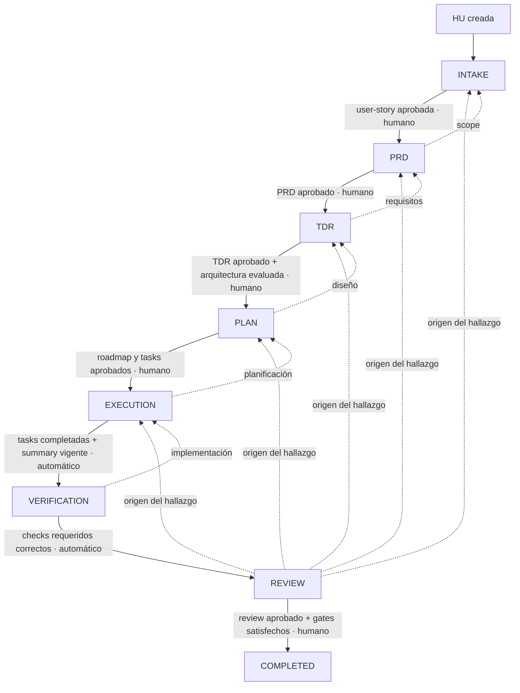

# Contrato del workflow SDD

**Estado:** aprobado

**Versión del contrato:** `1.0.0`

**Representación machine-readable:** [`.sdd/policies/workflow.yaml`](../.sdd/policies/workflow.yaml)

## 1. Autoridad y referencias

Este documento define la máquina de estados del workflow SDD. Ningún agente, skill, comando o integración CI puede crear transiciones distintas de las declaradas aquí.

Fuentes de referencia, por orden de precedencia:

1. [`ARCHITECTURE.md`](./ARCHITECTURE.md) y ADRs aprobadas.
2. Este contrato y su representación YAML.
3. [`architecture-status.md`](./architecture-status.md).
4. [`sdd-planing.md`](../sdd-planing.md).
5. Código existente.

Si este documento y `workflow.yaml` difieren, el workflow queda `BLOCKED` hasta corregir la contradicción. No se puede seleccionar silenciosamente una representación.

## 2. Tipos de cambio

Todos los tipos recorren inicialmente las mismas etapas. Sus condiciones de aprobación son distintas.

| Tipo | Uso | Política adicional |
|---|---|---|
| `feature` | Comportamiento nuevo o modificación funcional | No puede superar TDR ni completar mientras dependa de gaps bloqueantes aplicables. |
| `remediation` | Cierre de uno o más `GAP-*` | Debe declarar los gaps, aportar sus evidencias de cierre y no introducir ni empeorar desviaciones. |
| `harness-docs` | Harness o documentación sin cambios de runtime | Si modifica runtime, vuelve a INTAKE y debe reclasificarse. |

## 3. Estados

### 3.1. Etapas

```text
INTAKE → PRD → TDR → PLAN → EXECUTION → VERIFICATION → REVIEW → COMPLETED
```

`COMPLETED` es una etapa terminal. La cancelación se representa mediante el estado global `CANCELLED`, conservando la última etapa alcanzada.

### 3.2. Estado global de la HU

| Estado | Significado | ¿Terminal? |
|---|---|---:|
| `ACTIVE` | Puede ejecutar acciones permitidas en la etapa actual. | No |
| `BLOCKED` | Conserva la etapa, pero necesita una resolución externa o humana. | No |
| `COMPLETED` | Superó el review final. | Sí |
| `CANCELLED` | La HU se cerró sin completar. | Sí |

### 3.3. Estado de artefactos

| Estado | Significado |
|---|---|
| `DRAFT` | Versión editable que todavía no puede consumirse como aprobada. |
| `CHANGES_REQUESTED` | La versión fue revisada y necesita una nueva versión corregida. |
| `APPROVED` | La versión y hash exactos pueden ser consumidos por la siguiente etapa. |
| `REJECTED` | La versión es terminal y no puede editarse ni aprobarse posteriormente. |

Transiciones permitidas:

| ID | Origen | Destino | Gate | Efecto de versión |
|---|---|---|---|---|
| `AT-001` | `DRAFT` | `APPROVED` | Humano | Conserva la versión y fija su hash. |
| `AT-002` | `DRAFT` | `CHANGES_REQUESTED` | Humano | La versión deja de ser consumible. |
| `AT-003` | `DRAFT` | `REJECTED` | Humano | La versión queda terminal. |
| `AT-004` | `CHANGES_REQUESTED` | `DRAFT` | Humano | Crea una versión incrementada; conserva la anterior. |
| `AT-005` | `APPROVED` | `DRAFT` | Automático al detectar cambio | Crea una versión incrementada e invalida downstream; la versión aprobada permanece histórica. |
| `AT-006` | `REJECTED` | `DRAFT` | Humano | Crea una versión incrementada con motivo; la rechazada permanece terminal. |

Una transición que crea nueva versión no modifica el estado histórico de la versión origen. Cambia el puntero de versión vigente del artefacto.

### 3.4. Estado de ejecución

| Estado | Significado |
|---|---|
| `PENDING` | Trabajo autorizado todavía no iniciado. |
| `RUNNING` | Trabajo actualmente en ejecución. |
| `COMPLETED` | Trabajo y validaciones locales requeridas terminados. |
| `FAILED` | La ejecución terminó con error corregible. |
| `BLOCKED` | No puede continuar sin una decisión o dependencia externa. |

Transiciones permitidas por intento de ejecución:

| ID | Origen | Destino | Gate | Condición |
|---|---|---|---|---|
| `EX-001` | `PENDING` | `RUNNING` | Automático | Executor autorizado y scope vigente. |
| `EX-002` | `RUNNING` | `COMPLETED` | Automático | Trabajo y validaciones locales correctos. |
| `EX-003` | `RUNNING` | `FAILED` | Automático | Error registrado con evidencia. |
| `EX-004` | `RUNNING` | `BLOCKED` | Automático o humano | Causa de bloqueo registrada. |
| `EX-005` | `FAILED` | `PENDING` | Humano | Reintento autorizado; crea intento incrementado. |
| `EX-006` | `BLOCKED` | `PENDING` | Humano | Resolución registrada; crea intento incrementado. |
| `EX-007` | `COMPLETED` | `PENDING` | Automático por invalidación | Crea intento incrementado; el completado permanece histórico. |

`COMPLETED` es terminal para un intento concreto. Los reintentos y las invalidaciones crean un intento nuevo y nunca reescriben el anterior.

## 4. Flujo principal y gates



| ID | Origen | Destino | Gate | Condiciones obligatorias |
|---|---|---|---|---|
| `TR-001` | Nueva HU | `INTAKE` | Automático | ID, título y tipo de cambio válidos. |
| `TR-002` | `INTAKE` | `PRD` | Humano | `user-story.md` aprobado en su versión y hash vigentes. |
| `TR-003` | `PRD` | `TDR` | Humano | `prd.md` aprobado y sin dudas funcionales abiertas. |
| `TR-004` | `TDR` | `PLAN` | Humano | `tdr.md` aprobado; `ARCH-*`, gaps y ADRs evaluados; política del tipo de cambio satisfecha. |
| `TR-005` | `PLAN` | `EXECUTION` | Humano | Roadmap y todas las tasks aprobadas; scope de escritura definido. |
| `TR-006` | `EXECUTION` | `VERIFICATION` | Automático | Todas las tasks requeridas en `COMPLETED`; execution summary y hashes de código vigentes. |
| `TR-007` | `VERIFICATION` | `REVIEW` | Automático | Todos los checks obligatorios ejecutados y correctos para el commit evaluado. |
| `TR-008` | `REVIEW` | `COMPLETED` | Humano | Review aprobado, cero hallazgos bloqueantes y gates arquitectónicos satisfechos. |

Ninguna transición puede inferirse por la existencia de archivos. Debe registrarse explícitamente en el journal del harness.

## 5. Retornos y correcciones

Todo hallazgo debe clasificarse por su origen. Esa clasificación determina el retorno; el executor o improver no puede elegir una etapa más reciente para evitar invalidaciones.

| Origen del problema | Desde | Retorno | Artefacto que debe crear nueva versión |
|---|---|---|---|
| Scope o historia | `PRD`–`REVIEW` | `INTAKE` | `user-story.md` |
| Requisitos | `TDR`–`REVIEW` | `PRD` | `prd.md` |
| Diseño o arquitectura | `PLAN`–`REVIEW` | `TDR` | `tdr.md` |
| Planificación o dependencias | `EXECUTION`–`REVIEW` | `PLAN` | Roadmap o tasks |
| Implementación o tests | `VERIFICATION`–`REVIEW` | `EXECUTION` | Código, tests o execution summary |
| Fallo de verificación que exige cambiar implementación o tests | `REVIEW` | `EXECUTION` | Código, tests o execution summary corregidos |
| Evidencia ausente, obsoleta o rerun sin cambio de implementación | `REVIEW` | `VERIFICATION` | Nueva evidencia asociada al mismo commit vigente |
| Review incompleto | `REVIEW` | `REVIEW` | `review.md` |

`FAILED` y `BLOCKED` no avanzan de etapa. Sus recuperaciones se rigen por `EX-005` y `EX-006`. El estado global de la HU solo vuelve de `BLOCKED` a `ACTIVE` después de registrar resolución humana.

## 6. Aprobaciones humanas

Solo una acción humana explícita puede producir una aprobación. No se exigen roles distintos en la versión `1.0.0`, pero siempre se registra la identidad concreta.

Contrato mínimo:

```yaml
decision: APPROVED
artifact:
  path: SPEC/HU-001/prd.md
  version: 2
  sha256: 0123456789abcdef0123456789abcdef0123456789abcdef0123456789abcdef
approver:
  actor_type: human
  identity: person@example.com
approved_at: 2026-06-19T12:00:00Z
comment: null
```

Reglas:

1. `identity` debe ser estable y no vacía.
2. `actor_type` debe ser `human`; agentes y procesos automáticos no pueden aprobar.
3. La aprobación solo es válida para la ruta, versión y SHA-256 registrados.
4. Una modificación del artefacto invalida inmediatamente la aprobación.
5. Una aprobación invalidada permanece en el journal como evidencia histórica.
6. La misma persona puede aprobar gates diferentes.
7. `CHANGES_REQUESTED` obliga a crear una versión `DRAFT` incrementada.
8. `REJECTED` hace terminal la versión. Un humano puede cancelar la HU o reabrirla creando una nueva versión `DRAFT` y registrando el motivo.

### 6.1. Aprobación del propio contrato

La aprobación de este workflow se guarda fuera de los dos artefactos aprobados para evitar un auto-hash circular:

```text
.sdd/policies/workflow.approval.yaml
```

Contrato del registro:

```yaml
contract_version: "1.0.0"
decision: APPROVED
artifacts:
  - path: docs/SDD-WORKFLOW.md
    sha256: "<sha256>"
  - path: .sdd/policies/workflow.yaml
    sha256: "<sha256>"
approver:
  actor_type: human
  identity: "<identidad estable>"
approved_at: "<RFC3339 UTC>"
comment: null
```

Procedimiento:

1. Validar que las dos representaciones son coherentes.
2. Cambiar sus estados a `approved` sin modificar ninguna otra regla.
3. Calcular SHA-256 de ambos archivos ya definitivos.
4. Crear `workflow.approval.yaml` con esos hashes y la identidad humana.
5. Verificar de nuevo los hashes antes de considerar aprobada la Fase 0.

Cualquier cambio posterior en uno de los contratos invalida este registro, devuelve ambos estados a `pending_human_approval` y exige una aprobación nueva. El registro anterior se conserva en el historial Git.

## 7. Matriz de invalidación

| Cambio detectado | Invalida |
|---|---|
| `user-story.md` | PRD, TDR, plan, ejecución, verificación y review |
| `prd.md` | TDR, plan, ejecución, verificación y review |
| `tdr.md` | Plan, ejecución, verificación y review |
| Roadmap o tasks | Ejecución, verificación y review |
| Código o tests | Verificación y review |
| Cambio fuera del scope aprobado | Plan, ejecución, verificación y review; retorno a `PLAN` |
| Evidencia de verificación | Review |
| `review.md` | Aprobación final |
| `ARCHITECTURE.md` o ADR aplicable | TDR y todas las etapas posteriores |

La actualización de `architecture-status.md` producida por el mismo review no invalida ese review. Un cambio externo posterior sí invalida desde TDR cuando altere gaps, evidencias o reglas aplicables a la HU.

Toda invalidación:

- Cambia los artefactos afectados a estado no consumible.
- Conserva versiones, aprobaciones y evidencias anteriores en el journal.
- Registra causa, origen, identidad o proceso detector y timestamp.
- Impide avanzar hasta regenerar y aprobar lo necesario.

## 8. Políticas por tipo de cambio

### 8.1. `feature`

- Debe identificar componentes, datos y flujos afectados.
- `TR-004` queda bloqueada si existe un gap `BLOCKING` aplicable.
- `TR-008` vuelve a comprobar gaps y cumplimiento del backbone.

### 8.2. `remediation`

- Debe declarar al menos un `GAP-*` objetivo desde INTAKE.
- El TDR debe incorporar las condiciones de cierre publicadas en `architecture-status.md`.
- Solo puede completar si cierra todos los gaps declarados, no crea nuevos gaps y no empeora los restantes.
- El mismo review actualiza `architecture-status.md` con estado y evidencias.

### 8.3. `harness-docs`

- Debe declarar `runtime_changes: false`.
- Puede avanzar pese a gaps de runtime no aplicables.
- No puede ocultar gaps ni relajar `ARCH-*` sin ADR aprobada.
- Si modifica `apps/`, infraestructura, contratos productivos o comportamiento de runtime, retorna a `INTAKE` y se reclasifica.

## 9. Cancelación y reapertura

Una HU puede pasar de `ACTIVE` o `BLOCKED` a `CANCELLED` mediante acción humana con identidad, motivo y fecha. La cancelación no elimina artefactos ni journal.

Una HU cancelada no se reabre. Si el trabajo debe continuar se crea una HU nueva que referencia la cancelada. La reapertura definida en este contrato solo aplica a una **versión de artefacto rechazada dentro de una HU no cancelada**.

## 10. Códigos de bloqueo

| Código | Significado |
|---|---|
| `WF-INVALID-TRANSITION` | La transición no está declarada. |
| `WF-MISSING-ARTIFACT` | Falta un artefacto obligatorio. |
| `WF-STALE-ARTIFACT` | Hash o versión no coincide con lo aprobado. |
| `WF-MISSING-APPROVAL` | Falta aprobación humana vigente. |
| `WF-OPEN-QUESTIONS` | El artefacto contiene decisiones o preguntas abiertas bloqueantes. |
| `WF-ARCH-GAP` | Un gap arquitectónico aplicable bloquea la transición. |
| `WF-ARCH-VIOLATION` | El cambio incumple un `ARCH-*`. |
| `WF-CHECK-FAILED` | Un check obligatorio falló. |
| `WF-OUT-OF-SCOPE` | Se modificó una ruta o componente no autorizado. |
| `WF-HUMAN-DECISION` | Se necesita una decisión humana externa. |
| `WF-CONTRACT-DRIFT` | Documento y contrato machine-readable no coinciden. |

## 11. Escenarios de aceptación del contrato

| ID | Escenario | Resultado esperado |
|---|---|---|
| `WF-SC-001` | Feature sin gaps aplicables recorre todos los gates | Alcanza `COMPLETED` tras aprobación humana del review. |
| `WF-SC-002` | Feature depende de un gap `BLOCKING` aplicable | `TR-004` devuelve `WF-ARCH-GAP`; no entra en `PLAN`. |
| `WF-SC-003` | Remediation aporta evidencias y cierra todos sus gaps declarados | Puede superar `TR-008` y actualiza `architecture-status.md`. |
| `WF-SC-004` | Remediation no cierra uno de sus gaps o introduce otro | `TR-008` devuelve `WF-ARCH-GAP`; permanece en `REVIEW`. |
| `WF-SC-005` | Harness-docs modifica únicamente harness/documentación | Recorre el flujo pese a gaps de runtime no aplicables. |
| `WF-SC-006` | Harness-docs modifica runtime | Retorna a `INTAKE`, registra `WF-OUT-OF-SCOPE` y exige reclasificación. |
| `WF-SC-007` | PRD aprobado recibe `CHANGES_REQUESTED` | La versión queda no consumible; se crea versión incrementada `DRAFT` y se invalida desde TDR. |
| `WF-SC-008` | Artefacto recibe `REJECTED` y se decide continuar | La versión rechazada permanece terminal; un humano crea una nueva versión `DRAFT` con motivo. |
| `WF-SC-009` | Dependencia externa bloquea una ejecución | La HU pasa a `BLOCKED` sin cambiar de etapa; solo vuelve a `ACTIVE` con resolución registrada. |
| `WF-SC-010` | Un humano cancela una HU activa o bloqueada | Pasa a `CANCELLED`, conserva artefactos/journal y no puede reabrirse. |
| `WF-SC-011` | Una ejecución falla y se autoriza retry | El intento fallido permanece histórico y se crea un intento `PENDING` incrementado. |
| `WF-SC-012` | Una ejecución bloqueada recibe resolución humana | Se crea un intento `PENDING`, se conserva la etapa y la HU vuelve a `ACTIVE`. |
| `WF-SC-013` | Se modifica un artefacto aprobado | Se conserva la versión aprobada, se crea una nueva `DRAFT` y se invalida downstream. |
| `WF-SC-014` | Review detecta evidencia obsoleta o un fallo real de implementación | Rerun sin cambios vuelve a `VERIFICATION`; fallo que requiere código vuelve a `EXECUTION`. |

Estos escenarios deben convertirse en tests automáticos en la Fase 1. Hasta entonces se usan como matriz normativa de aceptación.

## 12. Criterio de cierre de la Fase 0

La Fase 0 estará completada cuando:

1. Este documento y `workflow.yaml` hayan sido revisados y aprobados por un humano.
2. Etapas, estados, transiciones, gates, retornos e invalidaciones coincidan en ambas representaciones.
3. No exista ningún estado no terminal sin salida válida.
4. Los escenarios `WF-SC-001`–`WF-SC-014` hayan sido revisados documentalmente y no contradigan ninguna transición o política.
5. La aprobación se registre en el plan general del harness.
