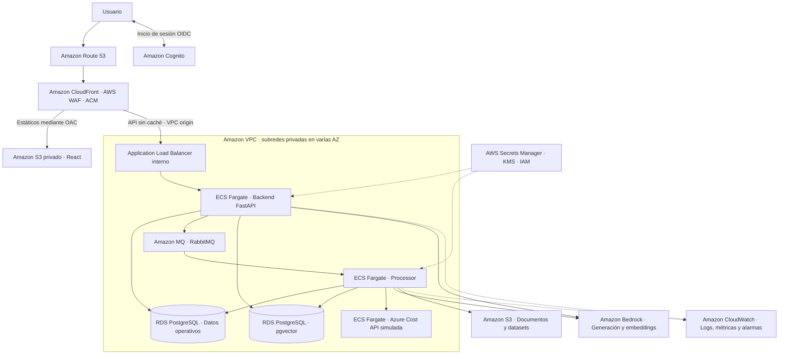
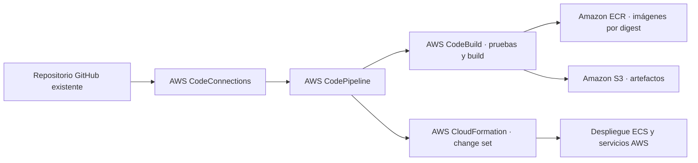

# Arquitectura de Economicon en AWS

Arquitectura de referencia con servicios gestionados de AWS para el entregable documental de [JUP-060 — Documentar arquitectura técnica](https://trello.com/c/alMIpBOQ). Actualizada el 10 de octubre de 2026.

**Alcance confirmado por el usuario: exclusivamente documentación. No se realizará ningún despliegue AWS.** Los componentes, alternativas y controles que siguen describen un diseño conceptual. No se crearán recursos, cuentas, dominios, pipelines ni tareas de implementación o migración como parte de este trabajo. No es necesario disponer de credenciales ni presupuesto cloud para completar el documento.

El diseño sitúa las aplicaciones de Economicon en ECS Fargate, RabbitMQ en Amazon MQ y datos y vectores en RDS PostgreSQL. Incluye Amazon Bedrock para IA. CockroachDB, la autenticación propia y los proveedores actuales difieren de esta arquitectura: sus adaptaciones se documentan como brechas técnicas hipotéticas, no como trabajo pendiente del proyecto.

**Ampliación solicitada el 10/10/2026:** se incorpora una [plantilla Terraform](../infra/aws-reference/README.md) como complemento técnico del documento. Define la variante pública con backend privado; se valida localmente con proveedores simulados y no se ejecuta contra AWS. Terraform se presenta como alternativa al aprovisionamiento CDK/CloudFormation del esquema. La preparación de IaC queda incluida por esta nueva petición; el despliegue y la adaptación de aplicaciones siguen fuera de alcance.

## Esquema de la arquitectura objetivo

El diagrama representa un escenario conceptual de acceso web público autenticado. La variante privada sustituiría CloudFront por Client VPN y un ALB interno. Son alternativas documentales, no fases de ejecución. Los servicios AWS regionales que aparecen fuera de la VPC no son contenedores dentro de ella.

La API valida el token de Cognito y resuelve los tenants autorizados en la base operativa. Cognito no reemplaza la autorización por tenant. La recuperación vectorial mantiene el filtro de tenant en cada consulta.

## Correspondencia con el proyecto

| Componente | Servicio AWS de referencia | Brecha técnica hipotética |
| --- | --- | --- |
| React | S3 privado y CloudFront | Compilar los estáticos, configurar rutas SPA y URL de API; no publicar el servidor de desarrollo. |
| Backend FastAPI | ECS Fargate y ALB | Task definition, healthcheck, permisos, configuración de producción y escalado. |
| Processor | ECS Fargate como servicio worker | Consumo persistente, cierre ordenado, reintentos, idempotencia y escalado por cola. Su API de salud queda interna. |
| RabbitMQ | Amazon MQ para RabbitMQ | TLS, credenciales, versiones y políticas de colas compatibles; probar confirmaciones, reconexión y redelivery. |
| CockroachDB | RDS PostgreSQL | Migrar dialecto, SQL, tipos, migraciones y comportamiento transaccional. No basta con cambiar el DSN. |
| PostgreSQL y pgvector | RDS PostgreSQL con extensión vector | Comprobar versiones e índices, importar datos y verificar dimensiones y aislamiento por tenant. |
| LLM y embeddings | Amazon Bedrock | Implementar proveedor/adaptador y repetir evaluación de calidad, coste y latencia. |
| Autenticación propia | Amazon Cognito | Adaptar login, JWT/JWKS, audiencia/emisor, expiración y asociación usuario–tenant. |
| Azure Cost API simulada | Servicio interno ECS Fargate | Mantener fixture y contrato actuales. Alojarlo en AWS no convierte el origen en costes AWS reales. |
| Documentos y datasets | Amazon S3 | Añadir lectura/escritura autorizada por tenant si el flujo actual recibe texto directamente. |
| Métricas y logs | Amazon CloudWatch | Instrumentación y colector para métricas de aplicación; no basta con activar logs de contenedores. |

Se elige Amazon MQ para conservar el protocolo RabbitMQ. SQS puede ser una evolución posterior, pero exigiría reescribir productores y consumidores, semántica de confirmación, visibilidad y cola de errores.

RDS operativo y vectorial son dos almacenes lógicos. Para una demo pueden compartir una instancia con bases y roles separados, tras verificar migraciones y permisos. En producción conviene evaluar instancias independientes para aislar consumo vectorial y transaccional; esta separación aumenta el coste.

El checkout local consultado conserva `mock`/`litellm` como proveedores y una validación de embeddings de 1536 dimensiones. Bedrock no está acreditado como sustituto directo. Cambiar modelo requiere ajustar validaciones/esquema y reindexar todo el corpus con el mismo modelo que las consultas. No se mezclan vectores de modelos distintos aunque tengan la misma dimensión.

## Red y seguridad

Diseño de producción: VPC en tres zonas de disponibilidad para contemplar el clúster de Amazon MQ. ALB y servicios de aplicación distribuidos al menos en dos AZ; RDS Multi-AZ; clúster MQ de tres nodos. Una demo con instancias únicas no ofrece la misma disponibilidad.

Las tareas Fargate no tienen IP pública y las bases de datos y el broker carecen de acceso público. Security Groups permiten únicamente ALB → backend, backend/processor → bases y MQ, y processor → simulador. La consola de RabbitMQ y los endpoints de métricas no se publican como rutas de producto.

CloudFront usa un origen VPC hacia el ALB interno y OAC hacia S3. El comportamiento de API desactiva caché, reenvía Authorization y X-Tenant-Id y respeta los métodos necesarios. Las rutas de la aplicación deben mapearse explícitamente: añadir `/api` en el borde no modifica automáticamente las rutas FastAPI. Verificar streaming, timeouts y límites del origen antes de adoptar el diseño para el chat.

HTTPS con ACM; certificado de CloudFront en us-east-1 y del ALB en su región. Secrets Manager almacena secretos; KMS protege datos; cada tarea recibe su propio rol IAM de mínimo privilegio, separado de los roles de ejecución y despliegue. TLS también para las conexiones a MQ y PostgreSQL. CORS se limita a los orígenes del frontend.

Prever conectividad de salida: endpoints VPC para ECR, S3, CloudWatch Logs, Secrets Manager y Bedrock según necesidades y disponibilidad regional; NAT cuando exista acceso a proveedores externos. Comparar su coste por AZ antes de seleccionar la combinación. Los endpoints tienen políticas y Security Groups, y no eliminan automáticamente todas las dependencias de internet.

## Variante conceptual de acceso privado

Usar AWS Client VPN → ALB interno → frontend estático en un contenedor ECS y backend. Resolver nombres con DNS privado; configurar rutas y autorización de la VPN. Mantener MQ, RDS y processor en subredes privadas. Esta variante evita una entrada pública de la aplicación, aunque añade coste de VPN y del contenedor del frontend.

La [propuesta anterior de EC2 y Compose](planning/aws-deployment-proposal.md) se conserva como antecedente comparativo. Su interpretación como plan para ejecutar una demo queda superada por la decisión de alcance exclusivamente documental. Ninguna de las dos alternativas se implementará. El diseño debe explicar que el CockroachDB local sin TLS/autenticación no sería adecuado para ese entorno.

## Diseño conceptual del pipeline con herramientas AWS

Este flujo se incluye como diagrama de arquitectura; el pipeline no se implementa. La plantilla Terraform complementaria define recursos como alternativa a CDK/CloudFormation y se entrega sin ejecutarlos. Los pasos descritos expresan cómo funcionaría el diseño.

Definir infraestructura mediante AWS CDK, sintetizada a CloudFormation. Separar red, datos, aplicaciones y observabilidad en stacks, con retención/protección para recursos persistentes. CodePipeline coordina pruebas, construcción, revisión del change set y despliegue. Se conserva GitHub como repositorio canónico.

Ejecutar migraciones como tareas ECS controladas, con un único ejecutor y respetando ownership: tablas del backend antes de las del processor. Auditar y adaptar los arranques actuales para que varias réplicas no migren en paralelo. Actualizar aplicación después de las migraciones compatibles, comprobar salud y conservar imagen anterior para rollback; un rollback de imagen no revierte datos automáticamente.

## Modelo conceptual de operación y costes

CloudWatch centraliza logs con retención acotada, errores, latencia, salud de tareas, profundidad/antigüedad de cola y conexiones a RDS. Añadir métricas de ingestas y aislamiento de tenant. Usar CloudTrail para auditoría de acciones AWS. Evitar prompts, respuestas y secretos en logs.

Configurar backups automáticos y recuperación a un punto temporal de RDS, versionado/lifecycle en S3 y simulacros de restauración. Los jobs necesitan estado durable e idempotencia para recuperarse tras fallos del broker; MQ no sustituye el backup de datos de negocio. RPO y RTO se definen y miden en el ensayo, no se presuponen por usar servicios gestionados.

AWS Budgets y Cost Explorer permiten seguimiento y avisos. Añadir etiquetas de proyecto/entorno/propietario/caducidad, límites de escalado y cuotas de consumo IA. Las alertas de presupuesto no constituyen un corte inmediato del gasto.

Los factores de coste que deben explicarse son horas/vCPU/memoria de Fargate, ALB y unidades de capacidad, RDS y almacenamiento/backups, broker MQ, NAT/endpoints por AZ, VPN, S3, transferencia, CloudFront/WAF, logs y consumo Bedrock. Una estimación ilustrativa en AWS Pricing Calculator requeriría supuestos explícitos de región, tráfico, concurrencia, corpus, retención y duración. No se requiere contratar servicios ni definir un presupuesto operativo para este entregable.

## Criterios de revisión documental

1. Incluir los diagramas de componentes, comunicaciones y pipeline AWS en el entregable de arquitectura de JUP-060.
2. Justificar la correspondencia del stack actual con los servicios AWS y sus alternativas.
3. Diferenciar capacidades existentes, diseño conceptual y brechas de compatibilidad, especialmente PostgreSQL, Cognito y Bedrock.
4. Explicar red, TLS, IAM, secretos, aislamiento por tenant, disponibilidad, backups y observabilidad como decisiones de diseño.
5. Identificar factores de coste y supuestos sin presentar una cotización o rendimiento como medidos.
6. Revisar coherencia con la arquitectura actual, ADR y fuentes AWS; incorporar el esquema a la documentación final mediante el proceso habitual de JUP-060.

La aceptación de esta aportación es documental: no exige despliegue, migraciones, pruebas en AWS, URL operativa ni evidencia de ejecución cloud.

## Fuentes técnicas

Consultadas el 10/10/2026. La selección de servicios es una propuesta para Economicon; las fuentes acreditan capacidades AWS, no compatibilidad ya probada de la aplicación.

- [ALB para Amazon ECS](https://docs.aws.amazon.com/AmazonECS/latest/developerguide/alb.html): balanceo y target groups de tipo IP.
- [Orígenes VPC de CloudFront](https://docs.aws.amazon.com/AmazonCloudFront/latest/DeveloperGuide/private-content-vpc-origins.html): acceso al ALB privado y requisitos regionales/de red.
- [Despliegues de Amazon MQ para RabbitMQ](https://docs.aws.amazon.com/amazon-mq/latest/developer-guide/rabbitmq-broker-architecture.html): TLS y modalidades de uno o tres nodos.
- [pgvector en RDS PostgreSQL](https://aws.amazon.com/about-aws/whats-new/2023/05/amazon-rds-postgresql-pgvector-ml-model-integration/): soporte de extensión; contrastar versión elegida.
- [Modelos de Bedrock](https://docs.aws.amazon.com/bedrock/latest/userguide/models-supported.html): catálogo y selección por región.
- Evidencia local: `tfm-economicon/README.md`, `docs/architecture.md`, `infra/litellm/README.md`, `apps/processor/app/core/config.py` y `docs/continuidad/cloud-aws.md`. El checkout consultado está en `feat/JUP-021-vector-database-runtime`; sus descripciones de madurez no son una auditoría de todos los cambios remotos.
