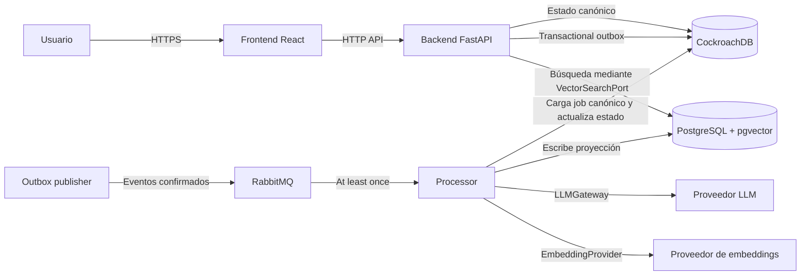
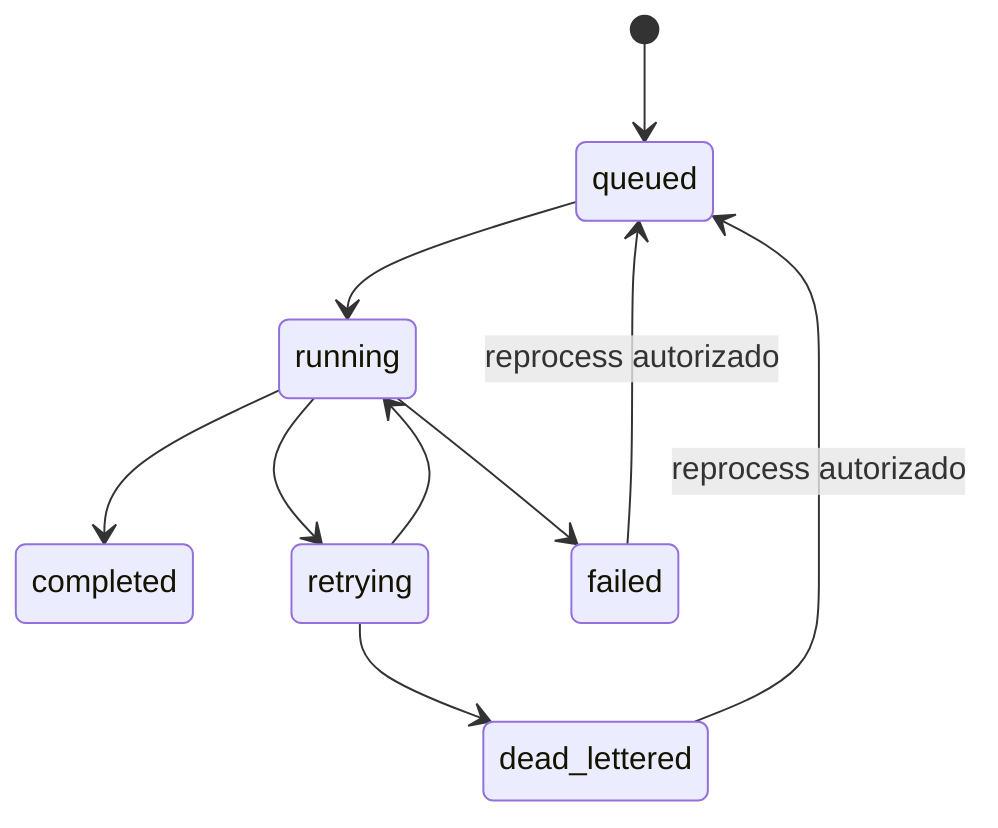

# Backbone técnico de arquitectura

**Estado:** normativo y bloqueante

**Ámbito:** todo el monorepo

**Audiencia:** agentes del harness SDD, responsables técnicos y reviewers
**Arquitectura objetivo:** producción cloud-agnostic

## 1. Autoridad y uso

Este documento es la fuente de verdad técnica del proyecto. Define las fronteras del sistema, la propiedad de los datos y los invariantes que todo cambio debe respetar.

Los términos se interpretan así:

- **MUST / DEBE:** requisito bloqueante.
- **MUST NOT / NO DEBE:** prohibición bloqueante.
- **SHOULD / DEBERÍA:** comportamiento esperado; cualquier desviación exige justificación en el TDR.

Orden de precedencia cuando existan contradicciones:

1. `docs/ARCHITECTURE.md` y ADRs aprobadas.
2. PRD y TDR aprobados de la Historia de Usuario.
3. Contratos versionados y documentación técnica vigente.
4. Código existente.
5. Documentación histórica o rechazada.

El código existente no convierte una desviación en una decisión válida. Los gaps conocidos se registran en [`architecture-status.md`](./architecture-status.md). La política es de **bloqueo por alcance con remediación incremental**:

- Una HU de nueva funcionalidad MUST NOT aprobarse mientras exista un gap bloqueante aplicable a los componentes, datos o flujos que modifica o de los que depende.
- Una HU de remediación puede aprobarse cuando cierre los gaps declarados en su alcance, no introduzca nuevas desviaciones y no empeore los gaps restantes.
- Un cambio exclusivo del harness o de documentación puede aprobarse si no modifica el runtime, no oculta gaps y no relaja ningún invariante sin una ADR aprobada.
- Cada aprobación incremental DEBE actualizar [`architecture-status.md`](./architecture-status.md) con las evidencias y el estado resultante.

Una excepción a un `ARCH-*` solo es válida si:

1. Existe una ADR en `docs/decisions/`.
2. La ADR identifica los invariantes afectados, alternativas, riesgos y fecha de revisión.
3. La ADR ha recibido aprobación humana explícita.
4. El PRD o TDR aplicable enlaza la ADR.

`docs/rejected/` es histórico. Sus propuestas MUST NOT tratarse como arquitectura vigente.

## 2. Contexto y límites del sistema



### 2.1. Componentes

| Componente | Responsabilidad | No es responsable de |
|---|---|---|
| `apps/frontend` | Presentación, interacción y estado de interfaz | Autorización efectiva, acceso a datos, colas o secretos |
| `apps/backend` | API, autenticación, autorización, casos de uso síncronos y creación transaccional de jobs | Ejecutar pipelines pesados o llamar directamente a SDKs LLM |
| `apps/processor` | Consumo de jobs, pipelines, LLM, embeddings y mantenimiento de la proyección vectorial | Exponer operaciones de negocio al usuario final |
| RabbitMQ | Transporte asíncrono con entrega *at least once* | Ser fuente de verdad o almacenar payload canónico indefinidamente |
| CockroachDB | Fuente de verdad transaccional y contenido canónico | Búsqueda vectorial especializada |
| PostgreSQL/pgvector | Proyección vectorial reconstruible | Contener el único ejemplar de información irreemplazable |

`packages/shared-config` puede contener configuración y contratos JavaScript compartidos. MUST NOT convertirse en un contenedor genérico de lógica de dominio ni acoplar frontend y servicios Python.

### 2.2. Propiedad de datos

CockroachDB es la única fuente de verdad para tenants, usuarios, membresías, conversaciones, mensajes, jobs, estado de ejecución y contenido de ingesta canónico.

PostgreSQL/pgvector contiene documentos normalizados, chunks y embeddings derivados. Toda fila vectorial MUST poder reconstruirse desde CockroachDB y configuración versionada del pipeline. El processor es owner de las escrituras y migraciones del esquema vectorial. El backend solo puede leerlo mediante `VectorSearchPort` y un adaptador compatible.

No existe una transacción distribuida entre ambos almacenes. La consistencia es eventual y se controla mediante jobs idempotentes, versiones de proyección y reconciliación.

## 3. Catálogo de invariantes

| ID | Invariante | Gate principal |
|---|---|---|
| `ARCH-01` | Aislamiento multitenant fail-closed | Seguridad y tests cross-tenant |
| `ARCH-02` | Fuente canónica y proyección reconstruible | Datos y recuperación |
| `ARCH-03` | Publicación transaccional mediante outbox | Consistencia DB-cola |
| `ARCH-04` | Mensajería versionada, mínima y trazable | Contrato RabbitMQ |
| `ARCH-05` | Procesamiento idempotente y reintentos acotados | Fiabilidad del worker |
| `ARCH-06` | Máquina de estados válida para jobs | Integridad operacional |
| `ARCH-07` | Capas pragmáticas y puertos en límites externos | Dependencias y testabilidad |
| `ARCH-08` | Acceso controlado a pgvector | Ownership de proyección |
| `ARCH-09` | Gateway único para LLM y embeddings | IA, privacidad y coste |
| `ARCH-10` | Autenticación, autorización y secretos seguros | Seguridad de plataforma |
| `ARCH-11` | Observabilidad correlacionada y sin datos sensibles | Operación |
| `ARCH-12` | Contratos y migraciones compatibles | Evolución y despliegue |
| `ARCH-13` | Validación automatizada proporcional al riesgo | Quality gates |
| `ARCH-14` | Despliegue portable y escalado explícito | Producción cloud-agnostic |

## 4. Invariantes detallados

### ARCH-01 — Aislamiento multitenant fail-closed

**Obligatorio**

- Toda operación sobre datos tenant-scoped DEBE recibir un `TenantContext` validado por el backend.
- El tenant activo DEBE derivarse de la identidad autenticada y de una membresía comprobada. Un `tenant_id` aportado por el cliente nunca es prueba de autorización.
- Repositorios, consultas, updates, deletes, mensajes, jobs, logs y métricas DEBEN conservar `tenant_id`.
- Las consultas por ID DEBEN incluir también el filtro de tenant o usar una constraint equivalente.
- Los esquemas DEBEN usar foreign keys, índices y unicidad compatibles con el aislamiento por tenant.
- La ausencia, inconsistencia o ambigüedad del tenant DEBE fallar de forma cerrada.

**Prohibido**

- Confiar en `tenant_id` del body, query string, metadata LLM o mensaje RabbitMQ sin contrastarlo con la fuente canónica.
- Ejecutar consultas tenant-scoped solo por identificador global.
- Registrar contenido, prompts, tokens o resultados sensibles para facilitar debugging.

**Evidencia para el reviewer**

- Tests positivos y negativos de acceso cross-tenant por endpoint y repositorio afectado.
- Consultas y constraints revisadas.
- Trazabilidad del tenant desde HTTP hasta job, pipeline y proyección vectorial.

### ARCH-02 — Fuente canónica y proyección reconstruible

**Obligatorio**

- CockroachDB DEBE conservar los datos necesarios para reconstruir pgvector.
- Cada proyección DEBE registrar `tenant_id`, identidad del documento, versión del pipeline, proveedor/modelo de embedding y timestamps.
- DEBE existir un procedimiento idempotente de reconstrucción y reconciliación.
- El borrado canónico DEBE propagarse a la proyección de forma auditable.

**Prohibido**

- Guardar exclusivamente en pgvector contenido, decisiones o resultados que no puedan regenerarse.
- Considerar completado un job antes de confirmar su estado canónico.

**Evidencia para el reviewer**

- Test de reconstrucción desde CockroachDB.
- Test de reconciliación ante proyección ausente o desactualizada.
- Documentación de backup y restore de la fuente canónica.

### ARCH-03 — Publicación transaccional mediante outbox

**Obligatorio**

- La creación del job y de su evento de outbox DEBE ocurrir en una única transacción de CockroachDB.
- Un publisher independiente DEBE publicar eventos pendientes con publisher confirms.
- El evento solo DEBE marcarse publicado después de confirmación del broker.
- El publisher DEBE tolerar reejecuciones y conservar métricas de backlog y antigüedad.

**Prohibido**

- Hacer `INSERT job` y `basic_publish` como dos operaciones sin mecanismo de recuperación.
- Eliminar eventos no confirmados o asumir que ausencia de excepción equivale a entrega.

**Evidencia para el reviewer**

- Test que simula caída de RabbitMQ después del commit.
- Test de publicación duplicada sin duplicar efectos.
- Métricas y consulta operativa del outbox pendiente.

### ARCH-04 — Mensajería versionada, mínima y trazable

Todo mensaje de ingesta DEBE usar un envelope equivalente a:

```json
{
  "schema_version": "1.0",
  "message_id": "uuid",
  "event_type": "ingestion.requested",
  "occurred_at": "RFC3339",
  "correlation_id": "uuid",
  "tenant_id": "tenant-id",
  "job_id": "job-id"
}
```

**Obligatorio**

- El processor DEBE validar el envelope y cargar el job canónico por `job_id` + `tenant_id` antes de procesar.
- Los contratos DEBEN estar versionados y admitir evolución compatible.
- `message_id` y `correlation_id` DEBEN propagarse a logs, estados y métricas.

**Prohibido**

- Enviar texto canónico, secretos, tokens, prompts completos o payloads de usuario en RabbitMQ.
- Procesar mensajes con versión desconocida o identidad tenant inconsistente.

**Evidencia para el reviewer**

- Schema validable y contract tests productor-consumidor.
- Tests de versión desconocida, mensaje malformado y tenant inconsistente.

### ARCH-05 — Idempotencia, reintentos y dead letters

**Obligatorio**

- El sistema DEBE asumir entrega *at least once*.
- Cada handler DEBE deduplicar por `message_id` y proteger efectos por identidad/versionado del job.
- Los reintentos DEBEN ser acotados, con backoff exponencial y jitter.
- Tras agotar el presupuesto, el mensaje DEBE ir a una DLQ y el job a `dead_lettered`.
- Los fallos permanentes DEBEN ir directamente a DLQ; los transitorios pueden reintentarse.
- La repetición DEBE evitar llamadas LLM, embeddings y escrituras ya confirmadas.

La configuración inicial recomendada es cinco intentos totales. Cualquier otro límite debe estar configurado, observable y justificado por TDR.

**Prohibido**

- `nack(requeue=True)` sin contador ni límite.
- Loops de retry internos no observables.
- Reprocesar manualmente una DLQ sin autorización, auditoría e idempotency key.

**Evidencia para el reviewer**

- Tests de duplicado, fallo transitorio, fallo permanente y agotamiento de retries.
- Métricas de retry y DLQ.

### ARCH-06 — Máquina de estados de jobs

Estados canónicos:



**Obligatorio**

- Las transiciones DEBEN ser atómicas, validadas y condicionadas por estado previo.
- `completed` solo es válido cuando los efectos requeridos están confirmados.
- El reprocesado DEBE crear auditoría y nueva versión/intento sin perder el historial anterior.

**Prohibido**

- Updates ciegos de estado solo por `job_id`.
- Convertir cualquier excepción en reintento automático.

**Evidencia para el reviewer**

- Tests de todas las transiciones válidas e inválidas.
- Historial de intentos y causa estructurada de fallo.

### ARCH-07 — Capas pragmáticas y puertos externos

**Obligatorio**

- La dirección conceptual es `delivery -> application -> domain`, con `infrastructure` implementando puertos definidos hacia dentro.
- DB, RabbitMQ, LLM, embeddings, reloj, generación de IDs y otros servicios externos DEBEN estar detrás de interfaces sustituibles.
- Routes y workers DEBEN traducir transporte; no contener reglas de negocio.
- Casos de uso complejos DEBEN orquestarse en la capa de aplicación.
- El dominio MUST NOT importar FastAPI, Pika, SQLAlchemy, LangChain ni SDKs externos.

No se exige DDD ni hexagonal completa para lógica trivial. La abstracción se introduce en límites externos o cuando protege una regla de negocio.

**Prohibido**

- Instanciar SDKs de infraestructura dentro de routes, dominio o nodos de pipeline.
- Crear capas pasantes sin responsabilidad real.
- Usar `shared-config` para compartir dominio entre runtimes.

**Evidencia para el reviewer**

- Diagrama de dependencias del TDR.
- Tests de aplicación con dobles de los puertos externos.

### ARCH-08 — Acceso controlado a pgvector

**Obligatorio**

- El processor DEBE ser el único writer y owner de las migraciones vectoriales.
- El backend DEBE acceder mediante `VectorSearchPort`; el adaptador puede consultar PostgreSQL directamente mientras respete el contrato.
- Toda búsqueda DEBE filtrar tenant antes de ordenar o limitar resultados.
- Los índices vectoriales y filtros tenant DEBEN dimensionarse y medirse con datos representativos.
- Cambios incompatibles de esquema DEBEN usar migración expand/contract.

**Prohibido**

- Escrituras vectoriales desde el backend.
- Consultas sin tenant o dependencia del orden interno de tablas.
- Eliminar datos canónicos como parte de una reconstrucción vectorial.

**Evidencia para el reviewer**

- Contract tests de `VectorSearchPort`.
- Explain plan o benchmark cuando cambie la búsqueda.
- Prueba de reconstrucción e aislamiento cross-tenant.

### ARCH-09 — Gateway único para LLM y embeddings

**Obligatorio**

- Toda llamada externa DEBE pasar por `LLMGateway` o `EmbeddingProvider`.
- Prompts y parámetros DEBEN estar versionados fuera de la lógica del pipeline.
- Antes de enviar datos se DEBE aplicar minimización, clasificación y redacción de secretos/PII.
- La política del proveedor DEBE declarar retención, región y uso para entrenamiento.
- Cada ejecución DEBE registrar metadata no sensible: tenant, correlation ID, proveedor, modelo, versión de prompt, tokens, latencia, coste y resultado técnico.
- Timeouts, rate limits, circuit breaking y presupuestos por tenant DEBEN ser explícitos.

**Prohibido**

- SDKs de proveedor fuera de adaptadores.
- Prompts inline en servicios, routes o nodos del grafo.
- API keys, contenido completo o respuestas sensibles en logs.
- Fallback silencioso a otro modelo o proveedor.

**Evidencia para el reviewer**

- Tests del gateway, redacción y límites.
- Evaluaciones reproducibles de calidad y regresión cuando cambie prompt o modelo.
- Estimación de coste en el TDR.

### ARCH-10 — Autenticación, autorización y secretos

**Obligatorio**

- El backend DEBE autenticar identidad y autorizar tenant/acción en cada frontera protegida.
- Contraseñas DEBEN usar un algoritmo especializado y parámetros actualizables.
- Tokens DEBEN validar firma, expiración, issuer y audience cuando aplique.
- Secretos DEBEN proceder de variables inyectadas o secret manager y rotarse sin cambios de código.
- Configuraciones inseguras de Docker Compose solo pueden activarse en perfil local.

**Prohibido**

- Credenciales por defecto en producción.
- Confiar en permisos enviados por el frontend.
- Exponer el processor como API de negocio pública.

**Evidencia para el reviewer**

- Tests de autenticación, autorización y aislamiento.
- Escaneo de secretos y configuración por entorno.

### ARCH-11 — Observabilidad correlacionada y segura

**Obligatorio**

- Backend, outbox publisher y processor DEBEN emitir logs estructurados.
- `correlation_id`, `tenant_id`, componente, operación, job y resultado técnico DEBEN propagarse cuando existan.
- DEBEN existir liveness y readiness diferenciados.
- Métricas mínimas: latencia/error HTTP, outbox pendiente, profundidad/edad de cola, duración de jobs, retries, DLQ, latencia LLM, tokens y coste.
- Las alertas DEBEN asociarse a una acción operativa o runbook.

**Prohibido**

- Incluir tokens, contraseñas, texto de documentos, prompts completos o respuestas sensibles en telemetría.
- Considerar healthy un proceso que no puede atender su responsabilidad principal.

**Evidencia para el reviewer**

- Tests de propagación/redacción.
- Dashboard o consultas reproducibles y runbook asociado.

### ARCH-12 — Contratos, migraciones y compatibilidad

**Obligatorio**

- APIs, mensajes y schemas persistidos DEBEN versionarse cuando su evolución pueda romper consumidores.
- Migraciones DEBEN ser repetibles, observables y compatibles con despliegue progresivo.
- Cambios destructivos DEBEN usar expand/contract y disponer de rollback o roll-forward probado.
- El startup de varias réplicas MUST NOT ejecutar migraciones concurrentes de forma insegura.

**Prohibido**

- Cambiar productor y consumidor asumiendo despliegue simultáneo.
- Reutilizar una versión de contrato con semántica incompatible.
- Borrar columnas o datos antes de retirar todos los consumidores.

**Evidencia para el reviewer**

- Contract tests y prueba de compatibilidad N/N-1 cuando aplique.
- Plan de migración, rollback/roll-forward y backup.

### ARCH-13 — Validación automatizada

**Obligatorio**

- Toda lógica de dominio DEBE tener tests unitarios.
- Todo adaptador externo DEBE tener tests de contrato o integración.
- Flujos críticos DEBEN cubrir cross-tenant, duplicados, caída del broker, retries/DLQ, reconstrucción vectorial y autorización.
- Frontend DEBE cubrir flujos de autenticación, selección de tenant, estados de carga/error y operaciones críticas.
- Los tests MUST NOT depender de proveedores LLM reales para ser deterministas.

**Prohibido**

- Aprobar una HU solo con mocks cuando modifica persistencia, mensajería o aislamiento.
- Reducir cobertura o eliminar tests para hacer pasar el gate.

**Evidencia para el reviewer**

- Comandos y resultados de lint, build, unit, integration y contract tests aplicables.
- Mapeo `REQ -> TASK -> TEST -> RESULT`.

### ARCH-14 — Despliegue y escalado cloud-agnostic

**Obligatorio**

- Los servicios DEBEN ser stateless fuera de los almacenes declarados.
- Configuración y secretos DEBEN inyectarse por entorno.
- Backend, publisher y processor DEBEN poder escalar independientemente.
- La concurrencia del processor DEBE ser efectiva, limitada y compatible con el prefetch del broker y los límites de proveedores.
- Shutdown DEBE dejar de aceptar trabajo, finalizar o liberar mensajes y cerrar conexiones limpiamente.
- Docker Compose es solo entorno local; producción DEBE usar TLS, credenciales no predeterminadas, persistencia y backups gestionados.

**Prohibido**

- Depender del filesystem local de un contenedor para estado duradero.
- Declarar configuración de concurrencia sin aplicarla y observarla.
- Acoplar el diseño a servicios propietarios sin un adaptador o ADR explícita.

**Evidencia para el reviewer**

- Tests de graceful shutdown y procesamiento concurrente.
- Documentación de configuración, capacidad, backups y recuperación.

## 5. Contrato de enforcement SDD

### 5.1. PRD

- Debe identificar requisitos que afectan seguridad, privacidad, disponibilidad, coste o datos.
- Debe listar `ARCH-*` aplicables y no puede proponer excepciones técnicas.

### 5.2. TDR

- Debe demostrar cumplimiento de cada `ARCH-*` aplicable.
- Debe incluir componentes, datos, contratos, tenant flow, failure modes, observabilidad, migraciones, rollback y pruebas.
- Cualquier excepción requiere ADR aprobada antes de cerrar el TDR.

### 5.3. Planificación y ejecución

- Cada `TASK-*` debe enlazar requisitos, decisiones e invariantes.
- Deben existir tareas específicas para contratos, migraciones, pruebas y documentación cuando apliquen.
- El executor MUST NOT reinterpretar ni debilitar un invariante.

### 5.4. Review

El reviewer debe emitir `CHANGES_REQUESTED` cuando:

- Una HU de nueva funcionalidad alcance o dependa de un gap bloqueante abierto.
- Una HU de remediación no cierre todos los gaps que declara, introduzca una desviación nueva o empeore un gap restante.
- Un cambio exclusivo del harness o de documentación modifique el runtime, oculte gaps o relaje un invariante sin ADR aprobada.
- Falte evidencia requerida por un invariante aplicable.
- Código, configuración, migraciones o tests infrinjan un `MUST` o `MUST NOT`.
- Una excepción carezca de ADR y aprobación humana.
- La trazabilidad `REQ -> ARCH -> TASK -> TEST -> RESULT` esté incompleta.

Hallazgos `SHOULD` pueden no bloquear únicamente si el TDR contiene justificación, riesgo residual y follow-up verificable.

## 6. Definition of Done arquitectónica

Una HU solo puede aprobarse cuando:

1. No existen gaps bloqueantes aplicables a su alcance, salvo los que la propia HU de remediación cierre y cuya resolución quede validada en el mismo review.
2. Todos los `ARCH-*` aplicables están identificados.
3. Los contratos y migraciones son compatibles.
4. Las pruebas obligatorias están ejecutadas y trazadas.
5. No se introducen accesos cross-tenant, payloads sensibles o dependencias externas directas.
6. Observabilidad, rollback y operación están definidos para el cambio.
7. La documentación y el registro de estado reflejan el resultado real.
