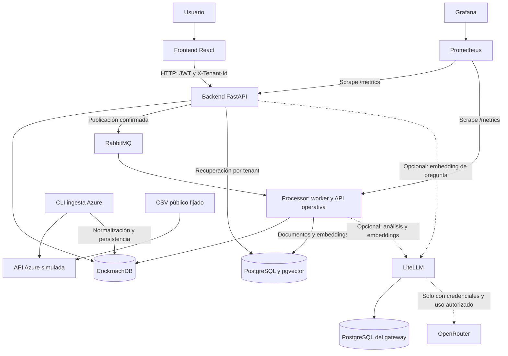
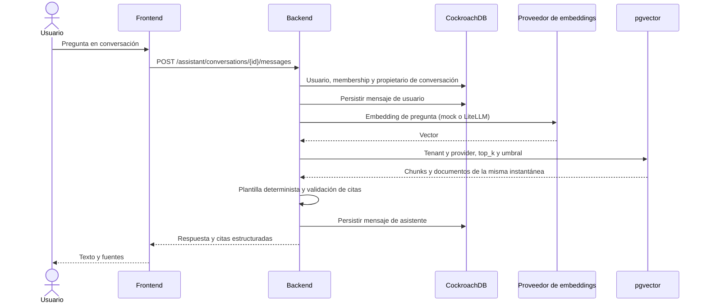
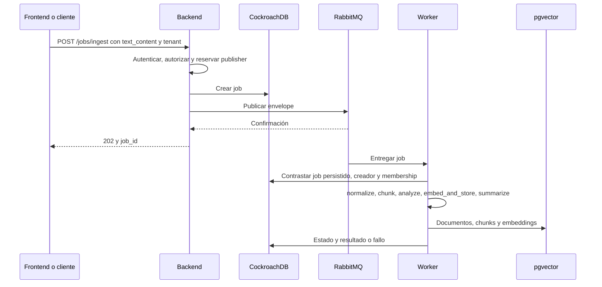
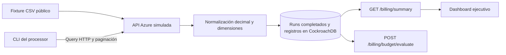
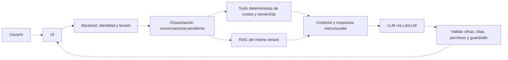
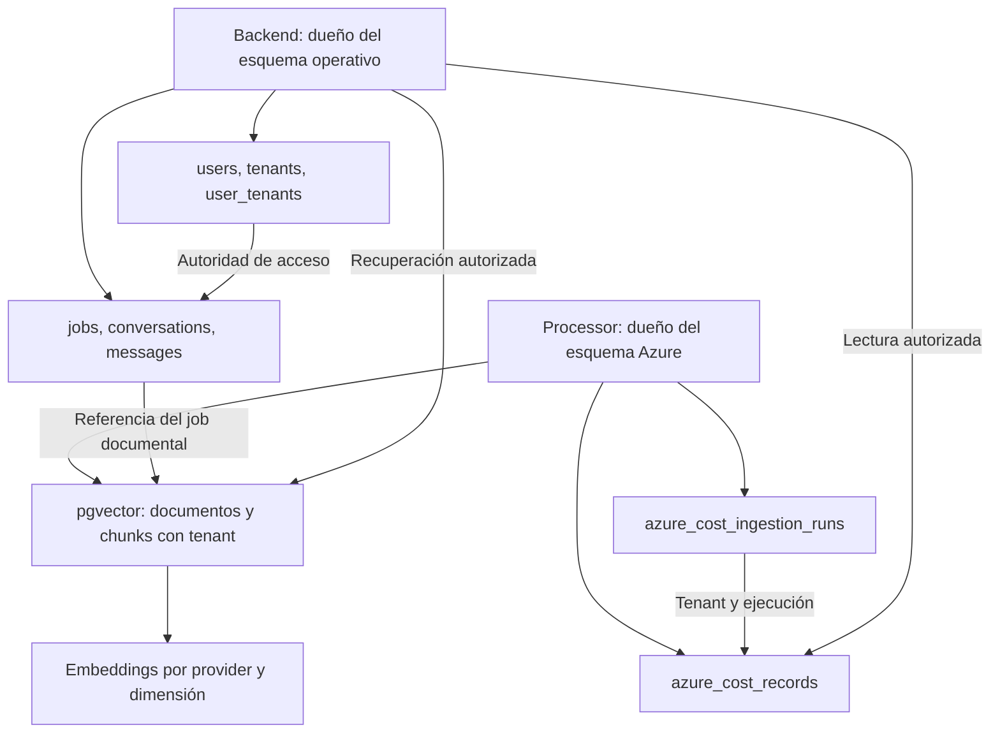
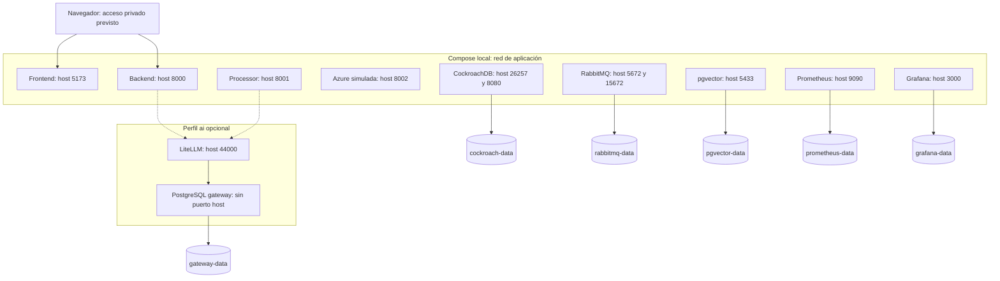
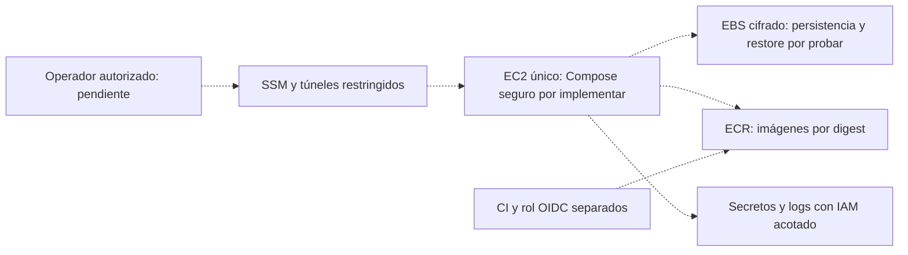

# Arquitectura técnica de Economicon

JUP-060 · [Trello](https://trello.com/c/alMIpBOQ) · Corte de código: **10/10/2026,
develop c2995a118d419dfe725247bac9c6f219a3f0ea77**. Esta vista sustituye las
descripciones históricas de billing fijo, aislamiento pendiente y citas pendientes.
Describe código integrado; las ejecuciones citadas conservan su fecha, host y SHA.
No certifica que un servidor esté ejecutando ahora esa versión.

## 1. Alcance y lectura

Economicon es un asistente FinOps para Azure con interfaz web, API, procesamiento
asíncrono y recuperación vectorial. El entorno reproducible es una demo con datos
públicos/sintéticos; no conecta a una cuenta Azure real. El chat actual recupera
contexto y devuelve una **plantilla determinista**. El processor dispone de un
cliente LLM, pero no compone todavía el vertical conversacional tools/RAG/LLM.

En los diagramas de bloques las flechas continuas describen conexiones implementadas;
las punteadas, capacidades opcionales o propuestas, rotuladas en cada figura.
En las secuencias, las flechas discontinuas representan el retorno de la llamada.
Configuración,
ejecución y aceptación son evidencias distintas. El [registro ADR](adr/README.md)
conserva las decisiones; el [informe JUP-060](evidence/JUP-060-validation.md)
relaciona criterios y comprobaciones. La memoria del TFM mantiene su
[fuente compartida y reglas](memoria/README.md): este documento es referencia
técnica, no una copia de sus apartados.

## 2. Componentes y fronteras

```mermaid
flowchart TB
  U[Usuario] --> UI[Frontend React]
  UI -->|HTTP: JWT y X-Tenant-Id| API[Backend FastAPI]
  API --> DB[(CockroachDB)]
  API -->|Publicación confirmada| Q[RabbitMQ]
  Q --> W[Processor: worker y API operativa]
  W --> DB
  W -->|Documentos y embeddings| V[(PostgreSQL y pgvector)]
  API -->|Recuperación por tenant| V
  CLI[CLI ingesta Azure] --> AZ[API Azure simulada]
  CLI -->|Normalización y persistencia| DB
  CSV[CSV público fijado] --> AZ
  API -.->|Opcional: embedding de pregunta| GW[LiteLLM]
  W -.->|Opcional: análisis y embeddings| GW
  GW --> GDB[(PostgreSQL del gateway)]
  GW -.->|Solo con credenciales y uso autorizado| OR[OpenRouter]
  P[Prometheus] -->|Scrape /metrics| API
  P -->|Scrape /metrics| W
  G[Grafana] --> P
```

| Componente | Responsabilidad y límite | Implementación |
| --- | --- | --- |
| Frontend | Sesión, tenant, conversaciones y dashboard ejecutivo conectado a billing. Paneles operativo, recortes, anomalías y recomendaciones conservan fixtures demo. No accede a DB, cola ni claves del proveedor. | [Cliente HTTP](../apps/frontend/src/services/api.ts), [rutas](../apps/frontend/src/routes.tsx) |
| Backend | Autenticación, autorización, costes/presupuesto, publicación de jobs, conversaciones, recuperación/citas y salud agregada. | [Rutas](../apps/backend/app/api/routes), [acceso](../apps/backend/app/api/dependencies.py) |
| Processor | Worker documental y pipeline LangGraph; CLI independiente para costes Azure. API de salud/métricas interna. AgentRuntime es módulo Python, no servicio de red. | [Pipeline](../apps/processor/app/graphs/pipeline.py), [CLI Azure](../apps/processor/app/run_azure_cost_ingestion.py), [agentes](../apps/processor/app/agents/service.py) |
| API Azure simulada | HTTP posicional, bearer local, paginación y errores reproducibles sobre CSV público. No autentica contra Azure ni representa una factura completa. | [README](../apps/azure-cost-api/README.md), [fixture](../fixtures/azure-cost/README.md) |
| LiteLLM, opcional | Proxy del processor y de embeddings del backend; claves virtuales separadas y DB propia. OpenRouter es el upstream configurado. | [Configuración](../infra/litellm/config.example.yaml), [operación](../infra/litellm/README.md) |
| Shared config | Configuración reutilizable del workspace; no es servicio de runtime. | [Paquete](../packages/shared-config/README.md) |

## 3. Flujos implementados y vertical objetivo

### 3.1 Chat síncrono: recuperación y citas

```mermaid
sequenceDiagram
  actor U as Usuario
  participant UI as Frontend
  participant B as Backend
  participant DB as CockroachDB
  participant E as Proveedor de embeddings
  participant V as pgvector
  U->>UI: Pregunta en conversación
  UI->>B: POST /assistant/conversations/{id}/messages
  B->>DB: Usuario, membership y propietario de conversación
  B->>DB: Persistir mensaje de usuario
  B->>E: Embedding de pregunta (mock o LiteLLM)
  E-->>B: Vector
  B->>V: Tenant y provider, top_k y umbral
  V-->>B: Chunks y documentos de la misma instantánea
  B->>B: Plantilla determinista y validación de citas
  B->>DB: Persistir mensaje de asistente
  B-->>UI: Respuesta y citas estructuradas
  UI-->>U: Texto y fuentes
```

La [ruta](../apps/backend/app/api/routes/assistant.py) no llama al processor ni
a la cola. [AssistantService](../apps/backend/app/services/assistant.py) muestra
hasta tres fragmentos o indica falta de contexto. La consulta vectorial filtra
tenant y proveedor, ordena por distancia coseno e identificador y limita con
`RETRIEVAL_TOP_K` (1–20, defecto 4). Con LiteLLM el umbral por defecto es 0.6;
mock no aplica umbral por defecto. Los embeddings reales requieren dimensión
1536 y el mismo modelo que la ingesta: cambiar de proveedor exige reindexar
en un almacén compatible, no mezclar vectores.

[Citas](../apps/backend/app/services/citations.py) valida cada referencia contra
chunks recuperados y tenant; devuelve documento/chunk, título, sección cuando
puede localizarse sin ambigüedad y fragmento. Fallos de embedding/retrieval devuelven 503; referencias
inválidas, 502. Como el mensaje de usuario se guarda antes de recuperar, un
fallo no implica que la conversación quede sin cambios. Las evidencias de
[recuperación](evidence/JUP-022-validation.md) y
[citas](evidence/JUP-025-validation.md) son históricas, no nuevas llamadas de JUP-060.

### 3.2 Ingesta documental asíncrona

```mermaid
sequenceDiagram
  participant UI as Frontend o cliente
  participant B as Backend
  participant DB as CockroachDB
  participant Q as RabbitMQ
  participant W as Worker
  participant V as pgvector
  UI->>B: POST /jobs/ingest con text_content y tenant
  B->>B: Autenticar, autorizar y reservar publisher
  B->>DB: Crear job
  B->>Q: Publicar envelope
  Q-->>B: Confirmación
  B-->>UI: 202 y job_id
  Q->>W: Entregar job
  W->>DB: Contrastar job persistido, creador y membership
  W->>W: normalize, chunk, analyze, embed_and_store, summarize
  W->>V: Documentos, chunks y embeddings
  W->>DB: Estado y resultado o fallo
```

`text_content` es obligatorio; `artifact_uri` es metadato, no prueba de descarga
ni extracción de archivos. No hay endpoint `GET /jobs/{id}` en esta base.
La figura muestra el camino exitoso; publicación rechazada, no enviada o de
resultado desconocido tiene tratamiento en
[jobs](../apps/backend/app/api/routes/jobs.py) y
[ADR-0009](adr/ADR-0009-rabbitmq-publisher-lifecycle.md). No hay transacción
distribuida DB/cola ni outbox; no se promete exactly-once ni reintento sin duplicados.

La fase analyze puede usar AgentRuntime/LiteLLM, schema FinOpsResponse y
guardrails. Su entrada contiene source, status y metadatos saneados; no recibe
la pregunta del chat, chunks ni consulta de costes. El mock produce
`insufficient_data`. Esto no acredita una respuesta generativa FinOps
fundamentada extremo a extremo.

### 3.3 Datos de coste y lectura de billing

```mermaid
flowchart LR
  F[Fixture CSV público] --> A[API Azure simulada]
  C[CLI del processor] -->|Query HTTP y paginación| A
  A --> N[Normalización decimal y dimensiones]
  N --> R[(Runs completados y registros en CockroachDB)]
  R --> B[GET /billing/summary]
  B --> D[Dashboard ejecutivo]
  R --> E[POST /billing/budget/evaluate]
```

La entrada comprobable es `python -m app.run_azure_cost_ingestion --tenant-id …
--subscription-id …` desde el processor; el job documental no llama a ese
servicio. La ingesta es idempotente por tenant/suscripción/definición y trata
errores sin registros de coste parciales. Véanse
[flujo Azure](architecture/azure-cost-e2e.md) y
[normalización](architecture/azure-cost-normalization.md).

Billing **sí lee** azure_cost_records de ejecuciones completadas: período UTC
semiabierto, dimensiones permitidas, importes decimales como cadenas y totales
separados por moneda. Rechaza solapamientos ambiguos con 409 según
[ADR-0010](adr/ADR-0010-azure-cost-source-overlap.md).
`savings_identified` es null; no hay ahorro realizado calculado.
`open_ingestions` cuenta todos los jobs del tenant en esta base, pese a su
nombre. Evaluar presupuesto no lo persiste ni envía notificaciones.
[Contrato billing](../openspec/specs/azure-cost-kpis/spec.md) y
[consulta SQL](../apps/backend/app/db/database.py).

### 3.4 Vertical objetivo: contratos pendientes de integración

```mermaid
flowchart LR
  U[Usuario] -.-> UI[UI]
  UI -.-> B[Backend: identidad y tenant]
  B -.-> O[Orquestación conversacional pendiente]
  O -.-> T[Tools deterministas de costes y ownership]
  O -.-> R[RAG del mismo tenant]
  T -.-> G[Contexto y respuesta estructurada]
  R -.-> G
  G -.-> L[LLM vía LiteLLM]
  L -.-> V[Validar cifras, citas, permisos y guardrails]
  V -.-> UI
```

**Todas las conexiones de esta figura son el objetivo de integración, no un
recorrido implementado.** Los contratos de
[tools](architecture/finops-agent-tools.md) y
[respuesta/guardrails](architecture/finops-response-guardrails.md) establecen
que la aplicación autoriza y ejecuta: el modelo no elige libremente tenant,
SQL, credenciales o acciones. No existe un registro ejecutor de tools FinOps
en el processor de esta base. Recuperación, citas, AgentRuntime y gateway
son piezas implementadas; conectarlas al chat requiere trabajo y validación
propios. Ni CI verde ni una prueba del proxy certifican ese vertical.

## 4. Que papel tienen RabbitMQ, CockroachDB y pgvector

```mermaid
flowchart TB
  B[Backend: dueño del esquema operativo] --> U[users, tenants, user_tenants]
  B --> J[jobs, conversations, messages]
  P[Processor: dueño del esquema Azure] --> R[azure_cost_ingestion_runs]
  P --> C[azure_cost_records]
  U -->|Autoridad de acceso| J
  R -->|Tenant y ejecución| C
  P --> D[pgvector: documentos y chunks con tenant]
  D --> E[Embeddings por provider y dimensión]
  J -->|Referencia del job documental| D
  B -->|Lectura autorizada| C
  B -->|Recuperación autorizada| D
```

Es un mapa lógico de responsabilidad/procedencia, **no un ERD de claves
foráneas entre bases**. CockroachDB guarda estado transaccional; pgvector
el índice recuperable; RabbitMQ transporta envelopes y conserva la cola
durable. La DB del gateway es independiente: no almacena costes FinOps.

Según [ADR-0011](adr/ADR-0011-single-owner-per-table.md), backend migra sus seis
tablas y processor las dos de Azure; cada servicio tiene su registro de
migraciones. Processor también actualiza estados de jobs, pero no es dueño de
su DDL: espera a backend sano después de migrar. El índice vectorial lo migra
processor; backend comprueba la dimensión al iniciar cuando puede consultar la
tabla, sin garantizar readiness del índice si esa comprobación se omite.
No hay commit atómico
entre CockroachDB, pgvector y RabbitMQ ni backup de conjunto demostrado.

## 5. Identidad, tenant y secretos

La API valida JWT propio HS256 (sub/iat/exp, tolerancia 5 s) y consulta al
usuario persistido. `X-Tenant-Id` selecciona una membresía de user_tenants;
no concede acceso por sí solo. Conversaciones/mensajes requieren además
usuario propietario. Documentos/chunks se comparten dentro del tenant.
Worker contrasta envelope con job persistido, creador existente y membresía vigente;
no confía en campos del productor. Roles guardados no equivalen a RBAC completo.
Fuentes: [ADR-0008](adr/ADR-0008-tenant-isolation-boundaries.md),
[sesión](../openspec/specs/demo-auth-session/spec.md) y
[evidencia de aislamiento](evidence/JUP-086-validation.md).

Frontend conserva sesión en localStorage, revalida /me y /tenants y gestiona
expiración/cambio de sesión. CORS usa orígenes explícitos
([ADR-0007](adr/ADR-0007-backend-cors-policy.md)); no sustituye autorización.
La auth demo [ADR-0014](adr/ADR-0014-demo-auth-boundary.md) no acredita IdP,
MFA, revocación ni seguridad de una aplicación pública.

Las credenciales operativas se suministran en runtime, fuera de Git e imágenes;
el simulador Azure conserva valores locales de prueba explícitos. Variables VITE_*
son públicas. Clave upstream OpenRouter y clave maestra quedan en gateway;
backend usa BACKEND_LITELLM_API_KEY de embeddings y processor su clave virtual.
No se publican valores en evidencias.
[ADR-0006](adr/ADR-0006-runtime-secret-boundaries.md) limita CockroachDB
`--insecure` a demo local desechable con development/test y opt-in explícito:
trasladar el host a cloud no amplía esa excepción.

## 6. Despliegue reproducible y propuesta cloud

### 6.1 Topología local declarada

```mermaid
flowchart TB
  Browser[Navegador: acceso privado previsto] --> F[Frontend: host 5173]
  Browser --> B[Backend: host 8000]
  subgraph Compose[Compose local: red de aplicación]
    F
    B
    W[Processor: host 8001]
    AZ[Azure simulada: host 8002]
    CR[CockroachDB: host 26257 y 8080]
    Q[RabbitMQ: host 5672 y 15672]
    V[pgvector: host 5433]
    P[Prometheus: host 9090]
    G[Grafana: host 3000]
  end
  subgraph AI[Perfil ai opcional]
    L[LiteLLM: host 44000]
    PG[PostgreSQL gateway: sin puerto host]
    L --> PG
  end
  B -.-> L
  W -.-> L
  CR --> CV[(cockroach-data)]
  Q --> QV[(rabbitmq-data)]
  V --> VV[(pgvector-data)]
  P --> PV[(prometheus-data)]
  G --> GV[(grafana-data)]
  PG --> LV[(gateway-data)]
```

Valores por defecto de [docker-compose.yml](../docker-compose.yml): **9 servicios
base y 5 volúmenes**; ai añade LiteLLM/PostgreSQL/gateway-data (**11 y 6**).
Las cuatro apps publican puerto **sin dirección loopback por defecto**;
las publicaciones de infraestructura sí usan 127.0.0.1. El objetivo privado
requiere configurar bindings/red/firewall del host: Compose por sí solo no
demuestra privacidad. /metrics tampoco exige auth al publicar la API.
La red base no restringe egress. No hay HA: host, bases single-node y cola
son puntos de fallo.

| Dependencia | Referencia fijada en código |
| --- | --- |
| CockroachDB | v24.1.11 por digest |
| RabbitMQ / pgvector | 3-management / pg17 por digest; esos tags no identifican patch por sí solos |
| Prometheus / Grafana | v2.55.1 / 11.3.0 por tag, sin digest |
| LiteLLM / DB gateway | 1.103.2 / postgres:17-alpine por digest |
| Apps Python | python:3.12-slim por digest; requirements usan rangos, no resolución pip completamente fijada |
| Frontend | node:20-alpine por digest; pnpm 9.0.0 y lockfile. CI usa Node 22 |

Los digests completos están en los Dockerfiles de las aplicaciones, Compose y
[Compose gateway](../infra/litellm/docker-compose.yml); no se mantiene otra
lista que pueda divergir. Son versiones del proyecto, no recomendaciones
de versiones actuales. Orden: DB/cola/vector sanos → backend migrado →
processor; processor espera además Azure. Frontend espera backend;
Prometheus espera backend/processor y Grafana espera Prometheus.
Grafana no tiene healthcheck Compose.

[Overlay ai](../infra/litellm/compose.ai.yml) exige gateway sano a ambos
consumidores. Activar solo el perfil no sustituye overlay, providers,
dimensiones ni claves. Seguir los recorridos mock/IA/retorno del
[README](../README.md), con proyectos separados para índices mock y reales.
Frontend sirve con **Vite preview**, no servidor de producción.
Las cuatro apps usan usuario sin privilegios, raíz de solo lectura y tmpfs;
no se extiende esa garantía a toda la infraestructura.
`down` conserva volúmenes nombrados; `down -v` los elimina.
Persistencia ante recreación no equivale a backup/restore.

### 6.2 Evidencia de despliegue

| Fuente | Afirmación soportada | Límite |
| --- | --- | --- |
| [JUP-049](evidence/JUP-049-validation.md) | Smoke histórico 08/09 en DockerServer, tree 1d05259b2db193bded864d7491a238d89e0f524c. | No estado vivo actual; sus cuatro volúmenes preceden a persistencia RabbitMQ. |
| [JUP-050](evidence/JUP-050-validation.md) | Ensayo 01/10 en Windows/Docker Desktop: nueve servicios, smoke 5/5, error con processor parado y persistencia down/up. | No Linux/macOS nuevos, backup/restore o runtime c2995a1. |
| [JUP-108](evidence/JUP-108-validation.md) | Pruebas históricas mock/IA, claves/gateway/persistencia, con upstream sintético y campaña real separadas en su informe. | No chat web generativo completo, nueva ejecución por JUP-060 ni permiso de consumo pagado. |
| [JUP-052 / PR #73](https://github.com/EconomiconFinOps/tfm-economicon/pull/73) | Trabajo de CD hacia DockerServer externo a la base revisada. | CD no integrado en c2995a1; esta revisión no verifica timer ni versión del host. |
| Revisión estática JUP-060 | Código/configuración disponibles para reproducir. | No inventario vivo, capacidad, HA, RPO/RTO o despliegue final aceptado. |

### 6.3 AWS: propuesta separada, sin provisioning

```mermaid
flowchart LR
  O[Operador autorizado: pendiente] -.-> S[SSM y túneles restringidos]
  S -.-> H[EC2 único: Compose seguro por implementar]
  H -.-> D[EBS cifrado: persistencia y restore por probar]
  H -.-> E[ECR: imágenes por digest]
  H -.-> M[Secretos y logs con IAM acotado]
  CI[CI y rol OIDC separados] -.-> E
```

Todo este diagrama es **propuesto**. La
[propuesta AWS del 09/10](planning/aws-deployment-proposal.md) se conserva como
aportación revisable: demo temporal privada EC2/Compose/SSM, sin ingress de app;
publicación pública sería otra fase. Cuenta/región/presupuesto/duración/operador
y dominio siguen sin ratificar; no hay IaC o ensayo AWS acreditado.
La propuesta cita trabajo JUP-052 no integrado en esta base y precios históricos:
no son verificación actual ni autorización de gasto.

Antes de provisioning: acordar alcance/coste; implementar y probar DB/TLS/secretos
seguros, datos estables entre releases, IAM separado y manifiestos; revisar plan
de infraestructura. Después, en recursos autorizados: smoke auth/tenant/jobs,
backup/restore medidos, handoff y caducidad. RPO/RTO son objetivos. Exponer la app
exige además servidor web adecuado, TLS/DNS y decisión de auth pública.
JUP-060 no ejecuta estas operaciones.

## 7. Por que esta separado asi

| Elección | Justificación, alternativa y límite |
| --- | --- |
| Frontend/API/processor | Aislar presentación, autoridad de acceso y trabajo lento. Hacerlo todo en la petición acoplaría latencia/fallos; escalar workers es posibilidad, no benchmark. |
| CockroachDB + pgvector | Compatibilidad con estado operativo e índice existentes. [ADR-0013](adr/ADR-0013-pgvector-retrieval-baseline.md) explica ranking exacto; no se acredita superioridad de Cockroach frente a PostgreSQL ni necesidad de SQL distribuido. |
| RabbitMQ | Publisher confirmado y consumidor asíncrono según ADR-0009; exige tratar duplicados e incertidumbre DB/cola. |
| API Azure simulada | [ADR-0001](adr/ADR-0001-azure-cost-api-simulation.md): HTTP, paginación y errores sin tenant real; CSV directo no probaría ese contrato. Datos limitados. |
| LiteLLM/OpenRouter | [ADR-0002](adr/ADR-0002-litellm-openrouter.md): concentrar credenciales/políticas; su aceptación no implica calidad ni gasto autorizado. [ADR-0017](adr/ADR-0017-backend-query-embedding-own-key.md) separa clave del backend y fija compatibilidad de embeddings. |
| Compose local | [ADR-0015](adr/ADR-0015-local-compose-deployment-boundary.md): topología reproducible; no selecciona Kubernetes, HA o hosting productivo. |

Se conservan estados de los ADR originales, incluidos los Proposed:
documentar o integrar no ratifica decisiones. Esta consolidación no introduce
una decisión arquitectónica nueva.

## 8. Observabilidad, entrega y límites

Prometheus scrapea backend/processor cada 15 s. Grafana aprovisiona dashboards
y alerta de fallos de ingesta, **sin receptor externo**. El contador mide
marcas de fallo persistidas, incluidos reintentos, no jobs únicos.
Los logs JSON con request_id y los estados de job ayudan al diagnóstico;
no se acredita stack central de logs ni trazado distribuido completo.
Fuentes: [monitorización](../apps/monitoring),
[ADR-0005](adr/ADR-0005-prometheus-grafana-metrics.md).
/health/status exige auth; diagnóstico de proveedor es explícito.
Salud HTTP de processor no confirma progreso del worker (worker_status puede
ser unknown). Calidad offline del asistente se documenta por separado en
[JUP-067](validation/JUP-067-metrics.md) y [JUP-070](validation/JUP-070-evaluation.md).

[CI](../.github/workflows/ci.yml) ejecuta gobernanza/OpenSpec, pruebas y sintaxis
de tres servicios Python, lint/test/build/typecheck frontend.
[Reviews](../.github/workflows/pr-reviews.yml) aplica el proceso JUP.
No se deduce despliegue de sus checks. Rama JUP → PR a develop → revisión y
validación separadas → integración según [CONTRIBUTING](../CONTRIBUTING.md).
El detalle académico DevOps corresponde al apartado f/JUP-111 y no se reescribe aquí.

Quedan por acreditar el vertical generativo conversacional, la cobertura de datos
y aceptación del MVP completo, el despliegue final y su recuperación, y la
incorporación revisada en la memoria. Los enlaces permiten revisar afirmaciones
sin convertir esas pendientes en resultados.
