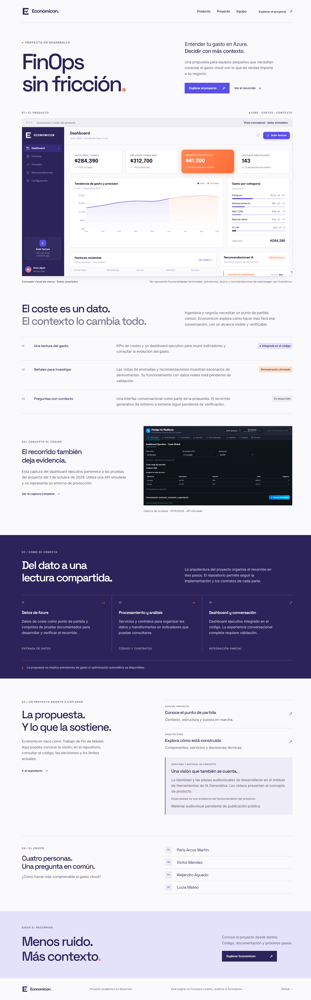

# JUP-089 — Landing promocional pública

Verificación: 10/10/2026, Europe/Paris. Base `c2995a1` (`origin/develop`).
[Tarjeta](https://trello.com/c/fD7nJKRl); rama
`feat/JUP-089-economicon-promotional-landing`.

Esta es evidencia técnica de implementación, no la review humana
`Validacion JUP-089`. La contribución se prepara con la cuenta `Iber1to` por encargo
explícito del usuario. Trello conserva liderazgo propuesto Paris Arcos Martin,
pairing Victor Mendez, revisión Alejandro Aguado y validación Lucia Mateo. No hay
pairing ni aceptación atribuida. Al ser Alejandro autor técnico de esta
contribución, su revisión independiente no puede inferirse; el liderazgo debe
decidir adopción o reasignación antes de sacar la PR de borrador.

## Entrega y fuentes

- `apps/landing`: HTML/CSS público independiente, sin JS de navegador, dependencias
  de runtime, API, sesión, cookies, analítica o formularios. Público significa
  artefacto apto para hosting separado; **todavía no desplegado públicamente**.
- Identidad coherente con JUP-112 y dossier: logo original, paleta, Space Grotesk
  e Inter autoalojadas (70.544 bytes WOFF2). No se modifica `apps/frontend`.
- Hero con concepto del dossier etiquetado **antes de las cifras**, captura
  histórica con API simulada, capacidades, arquitectura, documentación, equipo y
  CTA al repositorio público. [Procedencia y hashes](../../apps/landing/ATTRIBUTIONS.md).
- Preview `noindex`, configuración de dominio y vídeo explícita; 404 HTTP real,
  CSP y selección de fuentes públicas. [Runbook](../operations/public-landing.md).
- [OpenSpec](../../openspec/changes/jup-089-public-landing/proposal.md) y
  [ADR propuesto](../adr/ADR-0018-public-landing-boundary.md).

Se leyó la descripción completa del dispatch y se contrastó a **07:21:06Z del
10/10** mediante `Settings/TrelloClient` de la integración DockerServer. JUP-089
y JUP-112 conservaban descripción, prioridad y roles; no había nuevas acciones
JUP-089 en el lote de acciones devuelto (no se afirma un historial completo).
Lectura GitHub: sin PR JUP-089 previa y repositorio `PUBLIC`. No se consultó Trello
por ninguna vía alternativa ni se enviaron mensajes Discord.

## Evidencia por criterio de tarjeta

| Criterio | Resultado y límite |
| --- | --- |
| Dominio y responsable de renovación aprobados | **Pendiente**: decisión con hostname, titularidad, responsable/coste y hosting concretos en el runbook. Ningún dominio adquirido ni aprobación inventada. |
| HTTPS sin secretos ni datos internos | **Parcial**: artefacto sin configuración privada, lista explícita de archivos, sin peticiones externas/API; CSP y aislamiento probados. HTTPS, DNS y certificado del origen real pendientes. |
| Responsive y accesibilidad básica | **Verificado localmente** en Chromium a 320/390/768/1440; revisión visual adicional a375. Sin desbordamiento horizontal, imágenes/fuentes cargadas, teclado, foco y salto a main correctos. Axe sin infracciones automáticas WCAG A/AA en las cuatro anchuras; no certificación integral. |
| Mensajes contrastados; mocks no terminados | **Verificado en alcance documental**: mockup conceptual y captura 01/10/API simulada claramente separados; código integrado no se presenta como piloto, ahorro real ni recorrido generativo aceptado. M4/M5 siguen dependencias. |
| Rendimiento, accesibilidad y SEO medidos | Medición Lighthouse local registrada debajo. No rendimiento de producción ni aceptación del dominio. |
| Enlaces, vídeo, metadata y 404 | **Parcial**: enlaces/anclas/imágenes/favicon/metadata/configuración y 404 probados; tres destinos GitHub HTTP 200. Vídeo breve original decodificado y reproducido localmente silenciado, pero audio/subtítulos, destino y reproducción pública pendientes. No se inserta enlace ficticio. |
| Despliegue y rollback documentados | **Documento entregado** con promoción de dist inmutable y rollback; ejecución del proveedor pendiente de decisión de hosting. |
| PR revisado, CI verde y evidencia enlazada | Contribución preparada para PR borrador. Revisión/validación humanas y merge pendientes; CI se registra en la PR. No cerrar tarjeta por estos tests. |

## Verificaciones ejecutadas

Entorno local: Windows, Node **24.14.1**, pnpm **9.0.0**, OpenSpec **1.8.0**,
Playwright **1.61.0**, Chromium **149.0.7827.55**, axe-core **4.10.3**.
Workflow `Public landing checks` fijado a Node **22**; no confundir ejecución local
Node 24 con CI 22.

| Comando o comprobación | Resultado |
| --- | --- |
| `node --test apps/landing/tests/*.test.mjs` | **14/14** después de WOFF2; build 9 + servidor 5. |
| `npm --prefix apps/landing run lint` | Correcto: sintaxis del build, servidor y tests. |
| `node apps/landing/build.mjs` | Correcto: 12 archivos públicos, preview sin indexación. |
| `corepack pnpm jup:check:all` | Correcto, incluye JUP-089. |
| `corepack pnpm pr:check:test` | 57/57. |
| `corepack pnpm ci:check:test` | 12/12. |
| `corepack pnpm repository:governance:test` | 13/13. |
| `corepack pnpm openspec:validate` | 56/56, modo estricto. |
| `corepack pnpm jup:cleanup:check` y `git diff --check` | Correctos. |
| `corepack pnpm --filter @finops/frontend build` | Correcto; advertencia previa de bundle>500KB. Frontend sin cambios. |
| `corepack pnpm --filter @finops/frontend exec vitest run --maxWorkers=1 --no-file-parallelism` | 629/629 en 53 archivos, sin cambiar timeouts ni tests. |
| Navegador y axe |[Resultado completo](JUP-089/browser-qa.json): PASS, cuatro anchuras, 20 comprobaciones axe aprobadas por anchura, cero infracciones reportadas. |

Los tests de build cubren publicación/preview, retirada de sitemap al volver a
preview, exclusión de secretos/ficheros no seleccionados, URL inválida, escape de
HTML, fallo antes de sustituir salida, symlinks y recursos no permitidos. Los del
servidor cubren MIME, cabeceras, HEAD, traversal, métodos rechazados y 404 real.
URLs de publicación en tests son dobles: no se resuelven ni se declaran dominio
aprobado. El test de enlace de vídeo no prueba el reproductor remoto.

La auditoría inicial encontró contraste 4,38:1 en tres números decorativos; se
corrigió a 6,50:1 y se repitió axe sin infracciones. Casos `incomplete` de axe
(`aria-prohibited-attr`, `color-contrast`) requieren juicio humano; el evaluador
del agente revisó fuentes/capturas, teclado y movimiento reducido con dictamen
PASS, que no sustituye un lector de pantalla real ni reviews de equipo.

El primer comando de regresión del frontend, con concurrencia por defecto,
terminó con 575/629 aprobados y 54 fallos de tiempos/esperas. El código frontend
es idéntico a la base (`git diff origin/develop -- apps/frontend` vacío). La
ejecución de un trabajador terminó con **629/629 en 53 archivos**, sin cambiar
timeouts ni tests. No se atribuye sin prueba
todo fallo a JUP-089 ni se declara verde el primer intento.

## Mediciones Lighthouse

Lighthouse **12.8.2**, Chromium 149, perfil móvil por defecto y throttling simulado,
preview local HTTP, **10/10/2026 07:49:00Z**. [Resultados y configuración](JUP-089/lighthouse-mobile-summary.json).

| Medida | Resultado |
| --- | --- |
| Rendimiento | 89/100; FCP 1,5 s, LCP 3,7 s, TBT 50 ms, CLS 0,008. |
| Accesibilidad automática | 100/100 tras corregir contraste. |
| Buenas prácticas | 100/100. |
| SEO | 58/100: preview deliberadamente no indexable; Lighthouse no pudo descargar robots en su comprobación. |

`GET /robots.txt` comprobado aparte devuelve HTTP 200 y `User-agent: *` /
`Disallow: /`; se prueba también en la suite. No se oculta la limitación de la
medición SEO ni se relaja la preview para obtener una puntuación mejor. Canonical,
robots de publicación y sitemap se prueban con configuración ficticia válida;
falta medirlos en el dominio aprobado. La primera medición, anterior al ajuste
de contraste, dio 76/96/100/58 y avisó de CPU más lenta que la esperada; se conserva
como evidencia local, no como resultado final. No se promete el mismo rendimiento
desde un hosting público. Quedan oportunidades de compresión/caché y tamaños de
imagen para el hosting; las imágenes originales se preservan con su procedencia.

Informes completos HTML/JSON y pruebas de navegador están en
`materiales/07-evidencias/JUP-089-landing-2026-10-10/` del workspace. El repositorio
incluye el resumen numérico, resultados de navegador y capturas para revisión.
Reproducción: iniciar preview y ejecutar Lighthouse 12.8.2 sobre la URL con
`--only-categories=performance,accessibility,best-practices,seo --output=json --output=html`.

## Navegador y revisión visual

Preview `http://127.0.0.1:4179/`. Abrirla sin sesión, recorrer enlaces y volver
desde una ruta inexistente, usar Tab/Enter desde el salto al contenido y repetir
con anchuras 320/390/768/1440. Comprobar Network sin terceros, imágenes y fuentes
cargadas. CSS respeta `prefers-reduced-motion`. El sitio no necesita JavaScript.
Los tres links externos de la página devolvieron HTTP 200 el 10/10.

[Captura completa móvil](JUP-089/mobile.png). Las capturas interiores históricas
son material del proyecto; estas dos imágenes documentan la landing implementada.

## Pendientes explícitos

Dominio/renovación, hosting/DNS/HTTPS, aprobación de audio/subtítulos y publicación
de vídeo, M4 funcional/M5 RC1, aceptación editorial, participación humana y reviews.
No se abrió DockerServer, no se compró un dominio y no se aplicó despliegue o
rollback. No hay datos reales de clientes ni garantías de ahorro en la landing.
