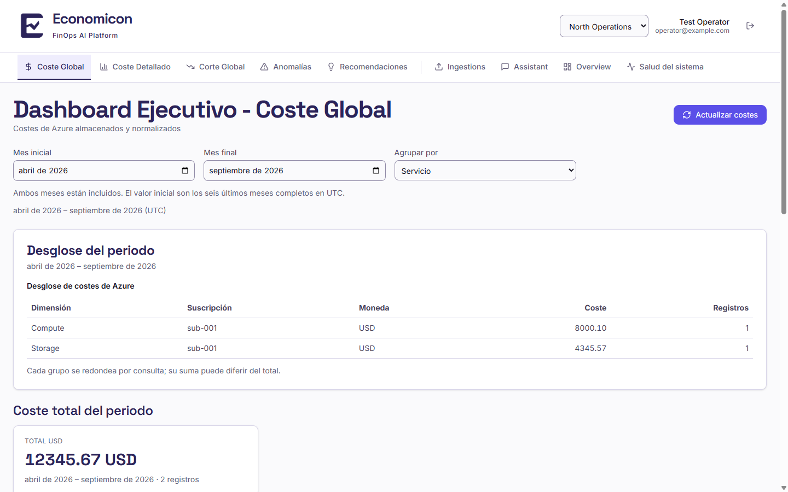
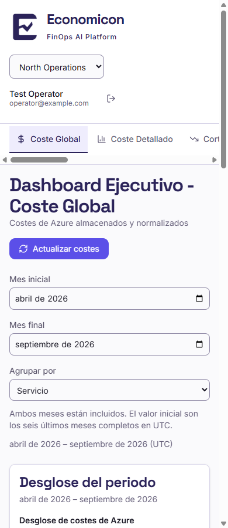

# Evidencia de implementación — JUP-112

Fecha: 2026-10-10, Europe/Paris. [Tarjeta](https://trello.com/c/XTZU3vj3).
Base `c2995a1`, rama `feat/JUP-112-brand`, [PR draft #102](https://github.com/EconomiconFinOps/tfm-economicon/pull/102). Este informe recoge comprobaciones del
candidato técnico, no una `Validacion JUP-112` humana ni aceptación de marca.

## Entrega

Paleta clara semántica de Economicon, logotipos originales del dossier, Inter y
Space Grotesk servidas localmente, acciones con contraste, foco y enlace para
saltar al contenido. Cabecera y páginas conservan sus rutas/datos; tablas anchas
tienen scroll interno y títulos/controles se adaptan a tamaños estrechos.
[Procedencia y contrato compartido](../frontend-brand.md).

## Criterios de tarjeta

| Criterio | Evidencia y estado |
| --- | --- |
| Resultado funcional verificable | Implementación frontend, build correcto y capturas con API simulada. Sin cambios en routes, hooks, services o datasets. |
| Pruebas necesarias añadidas y en verde | Suite final: 55 archivos y 667 pruebas PASS, con timeouts originales. Incluye contraste/BrandMark/foco, guardianes y regresión funcional existente. |
| Documentación y decisiones actualizadas | OpenSpec estricto 56/56, contrato de marca, ADR-0012 con evolución propuesta, README y ATTRIBUTIONS; aceptación humana del rediseño pendiente. |
| PR revisada y vinculada | PR102 draft vinculada; evaluación técnica separada PASS. Revisión humana Alejandro y pairing Victor pendientes, sin atribución inferida. |
| Validación funcional y evidencia enlazadas | Navegador real con mocks y evidencia propia; validación independiente Lucia/backend real pendiente. |

## Ejecución local

- Node 24.14.1, pnpm 9.0.0 por Corepack, Vite 5.4.21, Vitest 3.2.7.
- Fuentes `@fontsource-variable/inter` y `space-grotesk` 5.3.0, OFL1.1;
  avisos distribuidos también en `public/licenses/` y verificados en `dist/licenses/`.
- `corepack pnpm --filter @finops/frontend typecheck`: PASS (tres configuraciones).
- `corepack pnpm --filter @finops/frontend lint`: PASS.
- `corepack pnpm --filter @finops/frontend build`: PASS, 2486 módulos;
  JS 780.95 kB, gzip 225.24 kB. Aviso de chunk mayor de 500 kB; no impide build.
- `corepack pnpm openspec:validate`: PASS56/56 tras conservar escenarios
  existentes en el delta MODIFIED. El intento inicial detectó su omisión y se corrigió.
- `corepack pnpm jup:check:all`: PASS.
- `node --test tools/pr-policy.test.mjs tools/ci-workflow.test.mjs tools/repository-governance.test.mjs`:
  PASS82. Primer intento sandbox falló `spawn EPERM`; repetición autorizada PASS.
- Higiene: PASS986 archivos al ejecutar con subprocess permitido; primer intento
  sandbox `spawnSync git EPERM`, sin hallazgo de repositorio.
- Primera suite frontend serial:602 PASS/65 FAIL (55 archivos,991s), incluidos
  timeouts y una cascada `act()`. Contraste CI inicial:663 PASS/4 FAIL;
  acotó los defectos reproducibles a cuatro expectativas de presentación:
  la guardia todavía esperaba el borde antiguo y tres casos buscaban la clase
  del degradado eliminado (`from-card`). Se corrigieron conservando sus
  aserciones de borde, redondeado, títulos y procedencia de los datos.
  Repetición específica: guardia64/64 y salud61/61 PASS con timeout normal.
  Una repetición diagnóstica anterior usó `--testTimeout=30000` y no sustituye
  la ejecución completa final.
- **Suite final: 55/55 archivos, 667/667 pruebas PASS**, 241,78 s, timeout
  original. Comando desde `apps/frontend`:
  `node node_modules/vitest/vitest.mjs run --maxWorkers=1`.
  Log: `frontend-final.log` en el directorio de evidencia del workspace.

Los controles globales vía Turbo no concluyen correctamente en este entorno:
resuelven `pnpm` al fallback11 del runtime en lugar del Corepack9 del proyecto,
intentan auto-instalar y fallan (incluido exit3221226505). Se conserva la salida;
no se corrige el lanzador global dentro de esta tarjeta. No acredita pruebas
backend/processor ni integración real. Las pruebas propias usan Corepack directo.

## Navegador y reproducción

Servidor dedicado: `corepack pnpm --filter @finops/frontend dev --host 127.0.0.1
--port 5112 --strictPort`. La revisión usa Chromium real, respuestas API simuladas
y red externa bloqueada; no usa credenciales, Azure, modelos ni inferencia real.

1. Abrir login y las nueve rutas del menú con usuario/tenant sintéticos.
2. Repetir a1440/390px y comprobar login/coste/salud/recomendaciones a320/768px.
3. Comprobar carga/error/vacío, tabulación, salto al contenido, scroll interno de
   tablas y etiquetas/tooltips. Preferencia de sistema oscura debe conservar tema claro.
4. Verificar Inter/Space Grotesk cargadas desde el propio origen, texto normal
   ≥4.5:1 y foco/campos ≥3:1. El detector de navegador excluye opacidades,
   gradientes y SVG de sus conclusiones automáticas; se inspeccionan visualmente.

En el workspace de coordinación se conservan logs y PNG en
`materiales/07-evidencias/JUP-112-brand-2026-10-10/` (`visual/main`, `visual/smoke`).
Primer smoke con import `latin.css` inválido fue corregido usando entrypoints
de los paquetes. Las capturas fallidas permanecen separadas de las nuevas.
La revisión detectó y corrigió compresión de números en tablas y recorte de
etiquetas del gráfico de recomendaciones; se recaptura después de cada arreglo.

Resultado final visual: **50 combinaciones vigentes**,57 ejecuciones, anchuras
320/390/768/1440;0 overflow global,0 errores JS,0 solicitudes inesperadas,
0 fallos de fuentes y0 candidatos de contraste automático. Playwright1.61.0 /
Chromium149.0.7827.55. Se comprobó teclado/foco/hover/tooltips. La evaluación
separada del diseño es PASS (mismo proveedor), sin sustituir revisión humana.

[Resumen consolidado](JUP-112/visual-summary.json) identifica las capturas
vigentes y las sustituidas: además se corrigió `min-width:320px`, que con la
barra clásica de Windows causaba15px de overflow. Las rutas `main/`,
`final-responsive/` y `final-320/` del JSON se resuelven en el directorio
`visual/` del workspace de coordinación citado arriba. Muestra portable:

[Captura320px](JUP-112/cost-320.png) y
[recomendaciones móvil](JUP-112/recommendations-mobile.png).

[Comprobaciones de marca](JUP-112/brand-checks.json): preferencias clara y oscura
dan colores y fuentes iguales. En nueve capturas representativas, el máximo de
superficie violeta (color exacto más tonos cercanos con tolerancia conservadora)
es **3,7647 %**, inferior al límite orientativo del 10 %. Se registra denominador
por captura y método; no se extrapola a pantallas o contenidos no capturados.

## Pendiente

Comprobar CI del head publicado; los checks de revisión humana permanecerán
pendientes. La suite local y la matriz visual están finalizadas.
Pairing Victor, `Revision JUP-112` Alejandro, `Validacion JUP-112` Lucia,
aceptación visual de Paris/equipo, integración y cierre Trello siguen pendientes.
La revisión automatizada de agentes no sustituye ninguno de esos actos.

Como `Iber1to` publica el candidato y Alejandro conserva el rol de revisión,
Paris debe reutilizar esta contribución en una PR propia, o el equipo debe
regularizar explícitamente los roles en Trello antes de revisión formal. No se
aprueba la PR propia ni se reasigna un rol por inferencia.
