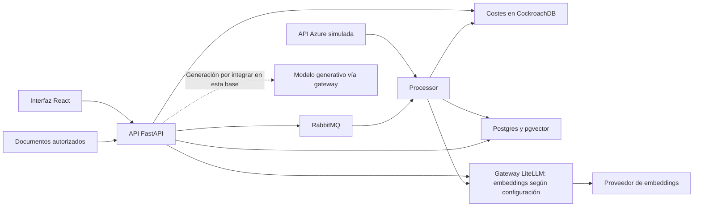

# JUP-066 — Guion de defensa de Economicon

Versión preparada el 10/10/2026. **Lista para revisión y ensayo; no ensayada ni aceptada.**
[Tarjeta](https://trello.com/c/6HjNIvoy) · [Fuentes y límites](fuentes.md) · [Ficha de ensayo](ensayo.md).

Mensaje central: **Economicon ayuda a entender una muestra de gasto Azure y a contrastar explicaciones FinOps con sus fuentes.** El beneficio para usuarios y el ahorro son hipótesis por evaluar.

## Duración y participantes

El guion oficial exige **10–20 minutos** y participación activa de todos los miembros; evalúa claridad, estructura, dominio, coherencia, argumentación, respuestas a preguntas y aportación individual. Verificado en el PDF original, página física 4 (impresa 5), y en `Guion_PJ.md`, «Evaluación». El PDF no fija calendario ni aclara si las preguntas computan dentro del máximo.

Propuesta de exposición: **18:00**, con **2:00 de margen hasta el máximo**, no dos minutos adicionales obligatorios. Confirmar con el tutor el tratamiento de preguntas; si están incluidas, usar el recorte de 15:00 descrito abajo. Las duraciones son presupuestos de ensayo, no tiempos medidos.

| Tiempo acumulado | Duración | Bloque | Ponente propuesto | Soporte que debe tener abierto |
| --- | --- | --- | --- | --- |
| 00:00–02:00 | 02:00 | Problema y valor | Lucia Mateo | Portada y ejemplo de decisión |
| 02:00–04:00 | 02:00 | Solución y enfoque de IA | Paris Arcos Martin | Flujo funcional y límites |
| 04:00–11:00 | 07:00 | Demo JUP-065 | Alejandro Aguado | Navegador o recorrido offline identificado |
| 11:00–14:00 | 03:00 | Arquitectura y DevOps | Victor Mendez | Esquema de componentes y una evidencia de ejecución |
| 14:00–16:00 | 02:00 | Resultados y evaluación | Paris Arcos Martin | Tabla de evidencia, no porcentajes comerciales |
| 16:00–18:00 | 02:00 | Trabajo futuro y cierre | Lucia Mateo | Límites, siguiente validación y aportaciones |

Lucía habla 4:00, Paris 4:00, Alejandro 7:00 y Víctor 3:00. Este reparto oral no cambia los roles de Trello ni demuestra autoría de componentes. Los cuatro deben confirmarlo en el ensayo. No existe todavía un deck final acreditado; los soportes de esta tabla son indicaciones para su preparación, no diapositivas ya producidas.

## 1. Problema — Lucía, 00:00–02:00

**Mostrar:** título «Entender el gasto cloud y poder explicar una decisión». Un ejemplo: una persona ve un cambio en su factura y necesita saber qué comparar antes de actuar. Es un caso ilustrativo, no una entrevista realizada.

**Texto oral:**

> Somos Alejandro Aguado, Paris Arcos, Lucía Mateo y Víctor Méndez. Presentamos Economicon, un asistente FinOps para ayudar a entender el gasto en la nube.
>
> Partimos de una situación concreta: un equipo pequeño recibe información de costes, pero le falta tiempo o conocimiento para interpretarla. Ver un importe no resuelve por sí solo qué periodo comparar, cómo repartir un compromiso o qué dato falta para investigar una variación.
>
> Nuestra hipótesis es que una explicación en lenguaje natural, acompañada de datos y fuentes comprobables, puede reducir esa dificultad. Nos dirigimos inicialmente a equipos sin una función FinOps especializada. Esa elección todavía requiere contraste con usuarios; no presentamos una demanda comercial validada.
>
> El alcance del trabajo se centra en Azure y una muestra pública servida por una API simulada. Esto nos permite preparar casos reproducibles sin usar la cuenta real de un cliente. El importe de la muestra no mide ahorro y no representa una factura completa.
>
> La propuesta combina consulta de costes y explicación de conceptos. Queremos que una persona pueda revisar de dónde sale una cifra y en qué se apoya una respuesta. Hoy separaremos lo que muestran los artefactos, lo que se observe en la demo y lo que queda por comprobar.

Reservar los últimos 15 segundos para una aportación personal confirmada según la ficha de ensayo; si aún no está confirmada, señalarla como pendiente en el ensayo y no inventarla.

**Transición:** «Paris explica cómo trasladamos esa necesidad al diseño del asistente».

## 2. Solución — Paris, 02:00–04:00

**Mostrar:** dos recorridos separados: costes estructurados → consulta; documentos → recuperación → respuesta con evidencia. No dibujar una conexión automática del chat al gasto de la cuenta como funcionalidad demostrada.

**Texto oral:**

> El diseño distingue los números de la explicación. El recorrido de costes ingiere la muestra, normaliza sus registros y permite consultar un periodo y un desglose. Mantener moneda, periodo y procedencia es parte de la interpretación: un valor sin ese contexto puede llevar a una conclusión equivocada.
>
> El recorrido documental prepara textos FinOps, los divide en fragmentos y utiliza representaciones vectoriales para recuperar información relacionada con una pregunta. Un modelo preentrenado puede utilizar ese contexto para elaborar una respuesta. Es el enfoque conocido como RAG. En este alcance no entrenamos un modelo desde cero ni hacemos fine-tuning.
>
> Recuperar un fragmento no garantiza que la respuesta sea correcta. Por eso comprobamos también si la cita respalda lo afirmado y si puede abrirse. Si falta información del cliente, la respuesta debe pedir alcance o reconocer la limitación, en lugar de inventar una causa o un importe.
>
> En la demostración usaremos una consulta de costes y una pregunta conceptual. No suponemos que el chat esté consultando automáticamente la tabla del dashboard. Tampoco mostramos una recomendación como una orden ejecutada sobre infraestructura real.
>
> La elección de RAG busca mantener el conocimiento del dominio revisable. Su utilidad efectiva depende del corpus, de la recuperación y del modelo realmente utilizado; esos elementos deben quedar identificados en cada ejecución.

Reservar 15 segundos para la aportación personal contrastada.

**Transición:** «Alejandro mostrará el recorrido y señalará qué estamos comprobando en cada paso».

## 3. Demo — Alejandro, 04:00–11:00

Usar la [versión fijada de JUP-065](https://github.com/EconomiconFinOps/tfm-economicon/blob/48ee74250714c6fe50946906824b80dc9ffd59fa/docs/demo/JUP-065/guion.md), su preflight, prompts íntegros y rúbricas. Esta tabla integra sus siete minutos en la defensa; no modifica el paquete ni sus criterios. **Al corte consultado, el registro de ensayo sigue `not_run`.**

Antes de empezar, elegir y anunciar exactamente un modo:

- **En vivo:** solo tras un ensayo integrado favorable del mismo despliegue. Decir commit, fecha y modo/proveedor realmente usado, sin secretos.
- **Grabación:** solo si existe un ensayo identificado y revisado. Decir fecha, commit y modo de esa grabación; no llamarlo ejecución actual. No se aporta una grabación en esta entrega.
- **Offline:** modo disponible con esta preparación. Decir: «Este es el recorrido preparado y sus resultados esperados. La ejecución integrada todavía está pendiente». Mostrar guion, referencias y esquema, sin simular una respuesta del producto.

| Reloj de defensa | Acción / pantalla | Frase oral y criterio observable |
| --- | --- | --- |
| 04:00–04:30 | Anunciar modo y alcance | «La fuente de costes es una API Azure simulada con muestra pública. La condición real o mock del modelo se identifica por separado». |
| 04:30–05:00 | Login y Core Finance | «Esta consulta pertenece al cliente seleccionado». Comprobar tenant visible sin mostrar credenciales. |
| 05:00–06:15 | `/`, Mes inicial y final `2024-06`, Grupo de recursos | «Seleccionamos junio; los datos son una muestra, no una factura mensual completa». Esperado: 0,06 USD, 38 registros y ocho grupos. UI `[2024-06-01, 2024-07-01)`; carga/referencia `[2024-06-01, 2024-06-20)`. Comparar contra el JSON fijado. |
| 06:15–06:45 | Growth Ops y vuelta a Core | «En el entorno dedicado, Growth no tiene esta carga». Esperado: vacío y vuelta a 0,06 USD. La separación visual no demuestra autorización completa entre tenants. |
| 06:45–07:15 | Evidencia de corpus ya ingerido | «Esta es la versión documental utilizada». Mostrar hash e identificadores de ingesta completada del ensayo; en offline, explicar el comprobante requerido sin fabricarlo. |
| 07:15–08:30 | Nueva conversación, JUP-069-004 completo | «¿Qué diferencia hay entre coste actual y amortizado para repartir una reserva?». Pegar el prompt original, no esta paráfrasis. Esperado: distinguir facturación y distribución temporal, sin sumar ambas vistas. |
| 08:30–09:15 | Abrir cita y recargar | «La referencia debe permitir comprobar esta explicación». Verificar documento, extracto pertinente y persistencia. Un identificador sin evidencia visible no basta. |
| 09:15–10:15 | Nueva conversación, JUP-069-003 completo | «Ante una subida de gasto sin contexto, esperamos preguntas de aclaración». Debe pedir alcance y periodo sin inventar causa, cifra o servicio culpable. |
| 10:15–11:00 | Límites y logout | Si lo observado es conforme: describir únicamente esos pasos. Si parcial/offline: «Hemos explicado el recorrido preparado; faltan las comprobaciones indicadas». Verificar salida a login solo si se ejecuta. Reservar una frase de contribución personal contrastada. |

La ingesta no se ejecuta durante los siete minutos. Growth debe estar limpio en una instancia propia, sin fixture sintético JUP-106; usar recursos nuevos según el preflight. No usar `remove --tenant` como si garantizara aislamiento de la retirada. No sumar importes de grupos ya redondeados para recalcular el total.

Comprobar que cada mensaje se envía a la conversación nueva seleccionada: RF-104-001 documentó retorno a la anterior. No usar `/anomalies`, `/operational`, `/cuts` o `/recommendations` como evidencia del gasto del cliente en este recorrido. La reserva de 1.000 EUR de JUP-069-001 es sintética, separada del dashboard, y se omite en el recorrido de 18 minutos.

**Transición:** «Víctor mostrará cómo se organiza el sistema que sostiene estos recorridos y cómo comprobamos sus cambios».

## 4. Arquitectura y DevOps — Víctor, 11:00–14:00

**Mostrar:** esquema a continuación. Es una síntesis del diseño documentado en la base, no una captura de servicios operativos. No indexar este material técnico en el corpus del asistente.

**Texto oral:**

> El repositorio separa interfaz, API, procesamiento asíncrono y simulador Azure. Esta separación permite distinguir lo que ocurre durante una consulta de lo que se prepara previamente.
>
> Para los costes, el procesador toma la muestra de la API simulada y persiste los registros normalizados en CockroachDB. La API los expone al dashboard. Para los documentos, la cola RabbitMQ desacopla la recepción del trabajo de procesamiento; los fragmentos y sus vectores permiten recuperar contexto desde Postgres con pgvector.
>
> En la base revisada, el chat construye una respuesta determinista y todavía no invoca un modelo generativo. LiteLLM puede intervenir en los embeddings según la configuración; la generación de respuestas con LLM sigue siendo una integración pendiente, representada con línea discontinua. El modelo de embeddings, su dimensión y el índice deben ser compatibles. Cuando se integre la generación, habrá que identificar también su modelo y demostrar que el chat lo utiliza. Configuración y salud no sustituyen esa comprobación.
>
> Las decisiones incluyen compromisos. Simular Azure facilita repetir y comparar casos, pero limita lo que podemos afirmar sobre una conexión real. La cola permite trabajo asíncrono, pero obliga a seguir el estado hasta completado. RAG aporta contexto revisable, pero exige evaluar pertinencia y suficiencia de las fuentes.
>
> El trabajo se organiza mediante tarjetas, especificaciones, decisiones de arquitectura y pull requests. La integración continua ejecuta comprobaciones antes de incorporar cambios. Docker Compose describe el entorno de ejecución y la monitorización y los registros ayudan a seguir los servicios y sus flujos.
>
> En esta defensa debemos distinguir la evidencia de integración continua de un despliegue reproducido. Mostraremos el identificador y resultado del pipeline elegido solo si están comprobados. La automatización de despliegue y su funcionamiento en el entorno final necesitan su propio recibo; no se deducen de tener un archivo de configuración ni del éxito de CI.

Dedicar unos 30 segundos a señalar dos flechas en el esquema y una decisión con su ADR. Reservar 15 segundos para la aportación individual contrastada. Si no se aporta un recibo de despliegue vigente, decir «reproducción del despliegue final pendiente».

**Transición:** «Paris distingue ahora qué evidencia de evaluación tenemos y qué conclusiones permite».

## 5. Resultados — Paris, 14:00–16:00

**Mostrar:** esta tabla. Fecha y modo deben permanecer visibles al mencionar cualquier cifra.

| Evidencia disponible al preparar el guion | Qué permite afirmar | Qué no acredita |
| --- | --- | --- |
| Referencia offline JUP-065: 0,06 USD, 38 registros, ocho grupos | Existe un esperado fijo para contrastar la muestra | Ejecución del MVP, ahorro o factura mensual |
| JUP-070, ejecución 08/10/2026, commit `b12b3c8`, mock / plantilla sin modelo: 0 de 20 casos `answer` aceptados; 28 casos totales, todos `fail` | Una línea base desfavorable y provisional; casos críticos con juicio de una sola persona | Calidad del modelo generativo actual, validación humana definitiva o resultado comercial |
| Registro JUP-065 `not_run` al corte de consulta | La preparación existe; el ensayo sigue pendiente | Demo integrada superada |
| Memoria compartida: apartados c–i reservados al corte | Hay un trabajo de consolidación y redacción pendiente | Memoria final validada o aportaciones individuales aceptadas |

**Texto oral:**

> Presentamos tres niveles de evidencia: valores de referencia preparados, resultados históricos y resultados del ensayo elegido. No son intercambiables.
>
> La muestra de costes tiene un esperado que podemos recalcular y contrastar. En evaluación del asistente, la línea base que podemos citar corresponde al 8 de octubre y a una plantilla sin modelo, con proveedor mock. Ninguno de sus veinte casos de respuesta fue aceptado; la batería completa contenía veintiocho casos y todos fallaron. El denominador veinte se refiere solo a los casos de respuesta, no a toda la batería.
>
> Es una medición provisional: hay casos críticos con juicio de una sola persona. El resultado identifica una limitación, no demuestra calidad. Tener referencias que resuelven o un esquema correcto tampoco significa que una respuesta satisfaga la pregunta. No trasladamos latencias de un mock a un modelo externo ni presentamos un objetivo como una medición conseguida.
>
> Para valorar el modelo integrado necesitamos repetir el procedimiento con sus versiones, corpus, preguntas y rúbricas identificados, conservando también errores y bloqueos. Para valorar el beneficio de negocio necesitamos usuarios y una comparación que mida comprensión o esfuerzo. No tenemos aquí evidencia de ahorro real ni de ese beneficio medido.

Si hay nueva evaluación aceptada antes de la defensa, sustituir la tabla mediante revisión de su responsable, conservando fecha, commit, proveedor, numerador/denominador y enlace. Si no la hay, conservar este texto; no anunciar mejora por inferencia.

**Transición:** «Lucía cierra con los límites y el siguiente paso que permitiría comprobar el valor de la propuesta».

## 6. Trabajo futuro y cierre — Lucía, 16:00–18:00

**Mostrar:** tres pasos: completar evidencia integrada; contrastar utilidad con usuarios; ampliar con datos reales solo después de validar permisos, trazabilidad y operación.

**Texto oral:**

> La aportación de Economicon es una propuesta concreta para acercar datos y explicaciones FinOps a personas sin especialización, junto con un método para revisar esas explicaciones. El alcance actual permite preparar pruebas repetibles sobre una muestra Azure y hacer visibles los límites de las conclusiones.
>
> El primer trabajo pendiente es cerrar el recorrido integrado: fijar el despliegue, comprobar el proveedor realmente usado, las citas y la repetición independiente, y conservar la evaluación con sus fallos. Después podremos contrastar con usuarios si las respuestas se entienden y ayudan a investigar una decisión.
>
> Conectar datos reales, ampliar a otros proveedores cloud o profundizar en recomendaciones son líneas futuras. Requieren nuevos controles y evidencia; no forman parte de lo demostrado por este guion. La consolidación de la memoria y la justificación de cada contribución también deben terminarse antes de la entrega.
>
> Hemos organizado la defensa entre los cuatro. Cada uno debe poder explicar una contribución concreta y mostrar su artefacto o revisión, además de comprender el conjunto. El reparto de esta exposición no sustituye ese registro.
>
> Queremos que el usuario pueda comprobar de dónde sale una cifra, qué sostiene una explicación y cuándo falta información. Ese es el criterio con el que proponemos evaluar Economicon. Gracias; quedamos disponibles para las preguntas.

Dedicar 30 segundos a la tabla de aportaciones confirmadas de la ficha de ensayo. No leer nombres junto a contribuciones sin contraste individual. Si la defensa llega sin esa evidencia, explicar la limitación, sin atribuir pairing ni autoría por asignación.

## Incidencias, recorte y preguntas

**Fallo en directo:** Alejandro anuncia el paso y el síntoma, marca `fail` si el sistema funciona pero responde mal o `blocked` si una dependencia impide ejecutarlo. Si el proveedor supera 30 s, avisa; espera como máximo otros 30 s y pasa al recorrido offline. Es un límite de presentación propuesto, no un SLA. No reenviar repetidamente ante 502 ni sustituir respuestas por la rúbrica. Si falla login, costes, conversación o cita, detener ese tramo y explicar el esperado como tal. Mantener el bloque siguiente a las 11:00 o aplicar el recorte; no consumir indefinidamente el margen.

**Alternativa offline de siete minutos:** recorrer las mismas nueve filas sin ejecutar acciones: mostrar los datos de referencia, explicar el contrato de cada comprobación y el recibo que falta. Usar siempre «esperamos comprobar» y «pendiente». No existe un vídeo acreditado en esta entrega. El modo offline permite ensayar la exposición; no satisface el requisito de MVP funcional.

**Recorte preparado de 15:00:** problema 1:30, solución 1:30, demo 7:00, arquitectura 2:00, resultados 1:30 y cierre 1:30. Omitir el ejemplo ampliado de negocio, las explicaciones secundarias del esquema y la recapitulación repetida; conservar alcance, las cuatro intervenciones, resultados con límites y aportaciones personales. No añadir la reserva sintética. Ensayar este modo si el tribunal incluye preguntas en el máximo de 20 minutos.

| Pregunta probable | Primera respuesta propuesta | Quién responde primero |
| --- | --- | --- |
| ¿Qué problema y para quién? | Hipótesis de comprensión del gasto para equipos pequeños, pendiente de validación con usuarios. | Lucía |
| ¿Por qué RAG y no fine-tuning? | Conocimiento de dominio revisable y recuperación de fuentes; sigue siendo necesario medir calidad. | Paris |
| ¿El chat consulta la factura del cliente? | Este recorrido muestra muestra estructurada y pregunta documental separadas; no acredita esa integración automática. | Alejandro |
| ¿Por qué esos componentes? | Explicar un flujo y su compromiso con el ADR correspondiente, no enumerar tecnologías. | Víctor |
| ¿Qué calidad y ahorro habéis logrado? | Citar ejecución, modo y denominador; baseline mock desfavorable, ahorro no medido. No convertir objetivos en resultados. | Paris, con Lucía para impacto |
| ¿Qué hiciste tú? | Artefacto y acción atribuible, decisión, comprobación y límite; consultar ficha individual confirmada. | Persona preguntada |
| ¿Está desplegado y es reproducible? | Mostrar recibo del entorno si existe; en su ausencia, distinguir Compose/CI documentados de ejecución pendiente. | Víctor y Alejandro |

## Calendario y condición de uso

En [JUP-080](../../planning/JUP-080-milestones.json): entrega **23/10/2026**, ensayo **27/10/2026**, defensa **29/10/2026**, todos **provisionales**, pendientes de confirmación institucional y de equipo. La continuidad local recoge además una propuesta de ensayo el **28/10**, sin ratificación; reconciliar ambas propuestas, sin modificar el roadmap por inferencia. No se agenda un ensayo desde esta entrega.

Antes del uso final: Lucía acepta el discurso y el reparto, Paris contrasta contenido, Víctor revisa, Alejandro documenta controles, cada persona confirma su aportación y el equipo ejecuta la [ficha de ensayo](ensayo.md). Esta preparación no equivale a sus conformidades ni a una validación independiente.
