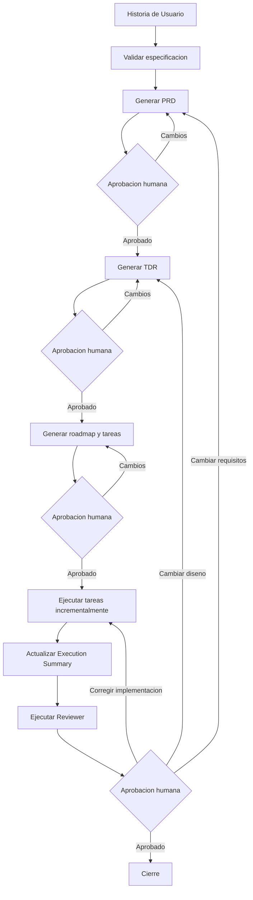

# Planificacion SDD

## Objetivo

Definir un flujo de Spec-Driven Development (SDD) trazable, incremental y sujeto a aprobaciones humanas. Ninguna etapa puede consumir un artefacto que no haya sido aprobado.

## Estados de aprobacion

Cada puerta de revision humana debe producir uno de estos estados:

- `APPROVED`: el artefacto puede pasar a la siguiente etapa.
- `CHANGES_REQUESTED`: debe corregirse y volver a revisarse.
- `REJECTED`: el flujo se detiene.

Las tareas de ejecucion pueden terminar como:

- `COMPLETED`: implementacion y validaciones terminadas correctamente.
- `FAILED`: la ejecucion termino con errores que requieren correccion.
- `BLOCKED`: no es posible continuar sin una decision o dependencia externa.

## Flujo SDD

### 1. Entrada y validacion

1. Copiar la Historia de Usuario en `SPEC/<HU-ID>/user-story.md`.
2. Validar que incluya contexto, objetivo, alcance y criterios de aceptacion.
3. Asignar identificadores trazables como `HU-001` y `AC-001`.
4. Resolver las carencias detectadas antes de generar el PRD.

### 2. Definicion funcional

1. Ejecutar la skill `prd-generator`.
2. Generar `prd.md` con requisitos identificados como `REQ-XXX`.
3. El humano revisa el PRD.
4. Si el resultado es `CHANGES_REQUESTED`, corregir el documento y repetir la revision.
5. Continuar solamente cuando el resultado sea `APPROVED`.

### 3. Diseno tecnico

1. Ejecutar la skill `tdr-generator`.
2. Generar `tdr.md` como Technical Design Record.
3. Documentar las decisiones tecnicas con identificadores `DEC-XXX` y relacionarlas con los requisitos.
4. El humano revisa arquitectura, contratos, datos, seguridad, migraciones, pruebas, observabilidad y rollback.
5. Corregir y repetir la revision hasta obtener `APPROVED`.

### 4. Planificacion

1. Ejecutar la skill `task-planner`.
2. Generar `roadmap.md` y los archivos `tasks/TASK-XXX.md`.
3. Cada tarea debe indicar requisitos relacionados, dependencias, alcance, modulos afectados, pruebas requeridas y criterios de finalizacion.
4. El humano revisa el roadmap y las tareas.
5. Corregir y repetir la revision hasta obtener `APPROVED`.

### 5. Ejecucion incremental

1. Ejecutar la skill `plan-executor` para una tarea o un lote pequeno de tareas.
2. Implementar los cambios y sus pruebas.
3. Ejecutar las validaciones relevantes del repositorio.
4. Registrar resultados, archivos modificados y desviaciones en `execution-summary.md`.
5. Repetir el proceso con la siguiente tarea.
6. Si aparece una decision no contemplada, detener la ejecucion y actualizar primero el artefacto correspondiente:
   - Volver al PRD si cambia el comportamiento o alcance del producto.
   - Volver al TDR si cambia el diseno tecnico.
   - Volver al roadmap si solo cambia la descomposicion del trabajo.

### 6. Revision

1. Ejecutar la skill `reviewer`.
2. Comprobar el cumplimiento del PRD, el TDR y los criterios de aceptacion.
3. Revisar defectos, regresiones, seguridad, calidad del codigo, pruebas y documentacion.
4. Generar `review.md` con hallazgos clasificados por severidad y vinculados a `REQ-XXX` o `TASK-XXX`.
5. El humano revisa el resultado.

### 7. Correccion y cierre

1. Si existen cambios solicitados sobre la implementacion, volver a `plan-executor`.
2. Si debe cambiar el diseno, volver a `tdr-generator` y repetir sus aprobaciones posteriores.
3. Si deben cambiar los requisitos, volver a `prd-generator` y repetir sus aprobaciones posteriores.
4. Repetir ejecucion y revision hasta resolver todos los hallazgos bloqueantes.
5. Ejecutar las validaciones finales.
6. Obtener la aprobacion humana final.
7. Marcar la Historia de Usuario como `COMPLETED`.

## Diagrama del flujo



## Skills propuestas

### Uso obligatorio de `docs/`

Todas las skills deben apoyarse en el contenido de la carpeta `docs/` para realizar sus funciones. Antes de producir o modificar un artefacto, cada skill debe:

1. Inventariar los documentos disponibles en `docs/` y sus subcarpetas.
2. Leer los documentos aplicables a su actividad y al alcance de la Historia de Usuario.
3. Respetar la arquitectura, convenciones, restricciones y decisiones vigentes que describen.
4. Registrar en su salida una seccion `Documentacion consultada` con las rutas utilizadas.
5. Registrar como `DOC-CONFLICT` cualquier contradiccion entre la documentacion, la especificacion aprobada y el repositorio.
6. Detenerse con estado `BLOCKED` cuando el conflicto pueda afectar requisitos, arquitectura o implementacion y necesite una decision humana.

La carpeta `docs/rejected/` se considera historial de alternativas descartadas. Debe consultarse para evitar reintroducir decisiones rechazadas, pero su contenido no se tratara como arquitectura vigente ni se implementara sin una aprobacion humana explicita.

Ninguna skill puede ignorar silenciosamente una regla documentada. Si una excepcion es necesaria, debe quedar justificada en el artefacto correspondiente y ser aprobada por el humano.

### Contratos de entrada y salida

Cada skill debe tener un schema de entrada y otro de salida, versionados y validables mediante JSON Schema Draft 2020-12. Los payloads pueden serializarse como JSON o YAML, pero deben cumplir el schema correspondiente.

```text
SPEC/schemas/skills/
|-- spec-intake/
|   |-- input.schema.json
|   `-- output.schema.json
|-- prd-generator/
|   |-- input.schema.json
|   `-- output.schema.json
|-- tdr-generator/
|   |-- input.schema.json
|   `-- output.schema.json
|-- task-planner/
|   |-- input.schema.json
|   `-- output.schema.json
|-- plan-executor/
|   |-- input.schema.json
|   `-- output.schema.json
`-- reviewer/
    |-- input.schema.json
    `-- output.schema.json
```

Todos los schemas de entrada deben exigir como minimo:

- `schema_version`: version del contrato.
- `correlation_id`: identificador comun de la ejecucion SDD.
- `skill`: nombre exacto de la skill invocada.
- `story_id`: identificador `HU-XXX`.
- `artifact_versions`: rutas, versiones y estados de aprobacion de los artefactos consumidos.
- `docs_context`: inventario de `docs/`, documentos aplicables y documentos excluidos con su motivo.
- `requested_scope`: alcance autorizado para la ejecucion.

Todos los schemas de salida deben exigir como minimo:

- `schema_version`: version del contrato utilizado.
- `correlation_id`: el mismo identificador recibido en la entrada.
- `skill`: nombre de la skill ejecutada.
- `status`: uno de los estados permitidos para esa skill.
- `artifacts`: rutas y versiones de los artefactos generados o modificados.
- `docs_consulted`: rutas de la documentacion realmente utilizada.
- `doc_conflicts`: lista de conflictos `DOC-CONFLICT`, vacia cuando no existan.
- `traceability`: relaciones creadas o verificadas entre `HU`, `AC`, `REQ`, `DEC` y `TASK`.
- `errors`: errores estructurados, vacio cuando la ejecucion termina correctamente.

Los schemas deben usar `additionalProperties: false` en los objetos de contrato, salvo en mapas expresamente extensibles. Una modificacion incompatible exige incrementar la version mayor del schema.

#### Contratos especificos por skill

| Skill | Entrada especifica | Salida especifica |
| --- | --- | --- |
| `spec-intake` | Ruta de `user-story.md` y reglas de validacion | Historia normalizada, `story_id`, criterios `AC-XXX`, carencias y estado de validacion |
| `prd-generator` | Historia validada, criterios de aceptacion y aprobacion de entrada | Ruta de `prd.md`, requisitos `REQ-XXX`, supuestos, exclusiones y estado |
| `tdr-generator` | PRD aprobado, contexto del repositorio y restricciones tecnicas | Ruta de `tdr.md`, decisiones `DEC-XXX`, componentes afectados, riesgos y estado |
| `task-planner` | PRD y TDR aprobados, decisiones y restricciones de entrega | Ruta de `roadmap.md`, lista de `TASK-XXX`, dependencias, orden y paralelismo permitido |
| `plan-executor` | Tareas aprobadas, alcance de archivos y validaciones requeridas | Estado por tarea, archivos modificados, pruebas ejecutadas y ruta de `execution-summary.md` |
| `reviewer` | Artefactos aprobados, cambios, pruebas y resumen de ejecucion | Ruta de `review.md`, veredicto, hallazgos por severidad y requisitos afectados |

El payload debe referenciar los artefactos por ruta, version y hash cuando sea posible, en lugar de duplicar todo su contenido. Esto permite comprobar que una skill consume exactamente la version aprobada.

### Ejecucion secuencial y paralela de subagentes

Las skills que puedan lanzar subagentes deben declarar durante su creacion si soportan ejecucion secuencial, paralela o ambas. El modo nunca debe inferirse de forma implicita en tiempo de ejecucion.

El schema de entrada de estas skills debe incluir:

- `execution_mode`: `sequential` o `parallel`.
- `agent_jobs`: trabajos que se delegaran, cada uno con identificador, agente, tarea, entradas y alcance autorizado.
- `dependencies`: relaciones de precedencia entre trabajos.
- `max_parallelism`: numero maximo de subagentes simultaneos.
- `conflict_policy`: comportamiento ante solapamientos o conflictos.
- `failure_policy`: si un fallo detiene, cancela o permite continuar los demas trabajos.
- `integration_strategy`: orden y mecanismo para integrar los resultados.

El schema de salida debe incluir:

- `job_results`: estado y artefactos producidos por cada subagente.
- `execution_order`: orden real de inicio y finalizacion.
- `conflicts`: conflictos detectados durante la ejecucion o integracion.
- `integration_result`: resultado consolidado y validaciones posteriores.

#### Modo secuencial

Debe utilizarse cuando:

- Un trabajo depende del resultado de otro.
- Varios agentes pueden modificar los mismos archivos o modulos.
- Una decision intermedia condiciona los siguientes trabajos.
- El riesgo de integracion hace necesario validar cada resultado antes de continuar.

El siguiente subagente solo puede comenzar cuando el anterior haya producido una salida valida y su estado permita continuar.

#### Modo paralelo

Solo debe utilizarse cuando:

- Los trabajos no tienen dependencias pendientes entre ellos.
- Sus alcances de escritura no se solapan.
- Consumen las mismas versiones aprobadas e inmutables de PRD, TDR y documentacion.
- Existe una estrategia explicita para integrar y volver a validar los resultados.

Cada trabajo paralelo debe ejecutarse en un contexto aislado. Antes de integrar, el orquestador debe comprobar conflictos de archivos, compatibilidad entre resultados, trazabilidad y validaciones conjuntas.

Si el orquestador detecta un solapamiento no autorizado, debe impedir el paralelismo y cambiar a ejecucion secuencial o devolver `BLOCKED`. El orden, limite de concurrencia y politicas concretas se definiran al crear cada skill.

### 1. `spec-intake`

Valida y normaliza la Historia de Usuario.

- Entrada: `user-story.md` y documentacion de `docs/`.
- Comprueba contexto, objetivo, alcance y criterios de aceptacion.
- Asigna identificadores `HU-XXX` y `AC-XXX`.
- Contrasta la Historia de Usuario con el dominio, la arquitectura y las restricciones documentadas.
- Salida: historia validada o listado de carencias.
- No permite continuar mientras falte informacion obligatoria.

### 2. `prd-generator`

Transforma la Historia de Usuario en requisitos funcionales verificables.

- Entrada: Historia de Usuario validada y documentacion de `docs/`.
- Salida: `prd.md`.
- Genera requisitos identificados como `REQ-XXX`.
- Incluye alcance, exclusiones, reglas de negocio, escenarios, supuestos y criterios de exito.
- Usa la documentacion vigente para identificar reglas, dependencias y limitaciones funcionales existentes.
- No inventa requisitos; registra dudas y supuestos de forma explicita.

### 3. `tdr-generator`

Define y registra el diseno tecnico.

- Entrada: `prd.md` aprobado, documentacion de `docs/` y contexto del repositorio.
- Salida: `tdr.md`.
- Incluye arquitectura, componentes afectados, contratos, datos, seguridad, migraciones, pruebas, observabilidad y rollback.
- Debe justificar cualquier desviacion respecto a la arquitectura y convenciones documentadas.
- Genera decisiones `DEC-XXX` relacionadas con requisitos `REQ-XXX`.

### 4. `task-planner`

Convierte el diseno aprobado en trabajo ejecutable.

- Entrada: PRD y TDR aprobados, junto con la documentacion de `docs/`.
- Salidas: `roadmap.md` y `tasks/TASK-XXX.md`.
- Define orden, dependencias, alcance, archivos probables, pruebas y criterios de finalizacion.
- Incorpora las tareas necesarias para conservar o actualizar la documentacion afectada.
- Produce tareas pequenas, verificables y ejecutables de forma incremental.

### 5. `plan-executor`

Implementa una tarea o un lote pequeno cada vez.

- Entrada: una o varias tareas aprobadas, el PRD, el TDR, la documentacion de `docs/` y el repositorio.
- Modifica codigo y pruebas.
- Ejecuta las validaciones relevantes.
- Sigue las convenciones documentadas y actualiza `docs/` cuando una tarea aprobada asi lo requiera.
- No cambia requisitos o diseno de forma silenciosa.
- Crea o actualiza `execution-summary.md`.
- Devuelve `COMPLETED`, `FAILED` o `BLOCKED` para cada tarea.

### 6. `reviewer`

Realiza una revision independiente de la implementacion.

- Entrada: PRD, TDR, roadmap, tareas, documentacion de `docs/`, cambios de codigo y resultados de pruebas.
- Salida: `review.md`.
- Revisa cumplimiento del PRD, TDR y documentacion vigente, ademas de defectos, regresiones, seguridad, calidad y cobertura de pruebas.
- Comprueba que la documentacion afectada haya sido actualizada y que no se hayan recuperado alternativas de `docs/rejected/`.
- Clasifica los hallazgos por severidad.
- Relaciona cada hallazgo con requisitos o tareas cuando sea posible.
- Devuelve `APPROVED` o `CHANGES_REQUESTED`.

## Orquestacion

El control del workflow no necesita ser una skill. Puede implementarse mediante un pequeno orquestador responsable de:

- Mantener los estados y aprobaciones.
- Impedir que se salten etapas.
- Seleccionar la siguiente skill permitida.
- Mantener la trazabilidad entre artefactos.
- Reanudar el flujo en el punto correcto despues de una correccion.

El `execution-summary.md` debe ser responsabilidad de `plan-executor`, y la validacion del cierre debe formar parte de `reviewer`. No se necesitan skills independientes para estos dos artefactos.

## Subagentes propuestos

Las skills definen el procedimiento y las restricciones de una actividad. Los subagentes ejecutan ese procedimiento con un contexto, unos permisos y una responsabilidad delimitados.

### 1. `product-analyst`

Responsable de la definicion funcional.

- Usa las skills `spec-intake` y `prd-generator`.
- Analiza y normaliza la Historia de Usuario.
- Detecta ambiguedades, contradicciones y requisitos ausentes.
- Genera la trazabilidad `HU-XXX -> AC-XXX -> REQ-XXX`.
- No toma decisiones tecnicas ni implementa codigo.

### 2. `technical-architect`

Responsable del diseno tecnico.

- Usa la skill `tdr-generator`.
- Inspecciona el repositorio y sus patrones antes de proponer el diseno.
- Define arquitectura, contratos, datos, seguridad, migraciones, observabilidad y rollback.
- Genera decisiones `DEC-XXX` relacionadas con los requisitos.
- No implementa mientras el TDR no este aprobado.

### 3. `delivery-planner`

Responsable de convertir el diseno aprobado en trabajo ejecutable.

- Usa la skill `task-planner`.
- Genera el roadmap, las tareas y sus dependencias.
- Relaciona cada `TASK-XXX` con requisitos y decisiones tecnicas.
- Identifica las tareas que pueden ejecutarse en paralelo.
- Define las pruebas y condiciones de finalizacion de cada tarea.

### 4. `implementation-agent`

Responsable de implementar una tarea o un lote pequeno.

- Usa la skill `plan-executor`.
- Modifica el codigo y las pruebas dentro del alcance autorizado.
- Ejecuta las validaciones relevantes.
- Actualiza `execution-summary.md`.
- Detiene la ejecucion si necesita cambiar el PRD o el TDR.
- Devuelve `COMPLETED`, `FAILED` o `BLOCKED`.

Pueden ejecutarse varias instancias especializadas, como `implementation-backend`, `implementation-frontend` o `implementation-infrastructure`, solo cuando sus tareas, dependencias y archivos no entren en conflicto.

### 5. `verification-agent`

Responsable de validar el comportamiento de forma independiente.

- Ejecuta pruebas, analisis estatico, compilacion y validaciones de integracion.
- Comprueba los criterios de aceptacion y busca regresiones.
- Registra los comandos ejecutados y sus resultados.
- Informa de los problemas, pero no corrige el codigo que esta verificando.

### 6. `review-agent`

Responsable de la revision independiente final.

- Usa la skill `reviewer`.
- Revisa el codigo, las pruebas y el cumplimiento del PRD y del TDR.
- Clasifica los hallazgos por severidad.
- Genera `review.md` con referencias trazables.
- No puede ser la misma instancia que implemento los cambios.

### `sdd-orchestrator`

El agente principal actua como coordinador del flujo.

- Controla estados, versiones y aprobaciones humanas.
- Prepara el contexto minimo necesario para cada subagente.
- Impide que se salten etapas.
- Coordina implementaciones paralelas sin solapamientos.
- Devuelve el flujo a PRD, TDR, planificacion o ejecucion segun el tipo de cambio.
- No sustituye ninguna aprobacion humana.

```text
SDD Orchestrator
|-- Product Analyst
|-- Technical Architect
|-- Delivery Planner
|-- Implementation Agent(s)
|-- Verification Agent
`-- Review Agent
```

## Control de roles y `role-guardian`

No se incorpora inicialmente un subagente `role-guardian` permanente. Sus controles se distribuyen en tres niveles:

1. Las skills declaran las reglas y prohibiciones propias de cada actividad.
2. Los subagentes declaran su alcance, entradas, salidas y permisos.
3. El `sdd-orchestrator` valida las transiciones, aprobaciones y limites antes y despues de cada ejecucion.

El orquestador debe comprobar como minimo:

- Que la etapa anterior y sus artefactos estan aprobados.
- Que el payload de entrada cumple el schema y la version soportada por la skill.
- Que el modo de ejecucion solicitado esta soportado por la skill.
- Que el agente solo utiliza las skills permitidas.
- Que las entradas existen y corresponden a la version aprobada.
- Que la skill inventario `docs/`, consulto la documentacion aplicable y registro las rutas utilizadas.
- Que el agente no toma decisiones fuera de su rol.
- Que no se modifican archivos fuera del alcance autorizado.
- Que los trabajos paralelos no tienen dependencias ni alcances de escritura solapados.
- Que la implementacion no modifica silenciosamente el PRD o el TDR.
- Que se generan todos los artefactos obligatorios.
- Que el payload de salida cumple el schema antes de aceptar el resultado.
- Que se conserva la trazabilidad entre requisitos, decisiones, tareas y pruebas.
- Que los conflictos documentales se registran como `DOC-CONFLICT` y no se resuelven silenciosamente.

Ejemplo de contrato declarativo:

```yaml
agent: implementation-agent
allowed_skills:
  - plan-executor
allowed_inputs:
  - prd.md
  - tdr.md
  - roadmap.md
  - tasks/TASK-*.md
  - docs/**
allowed_outputs:
  - source-code
  - tests
  - execution-summary.md
forbidden:
  - modificar requisitos
  - aprobar su propio trabajo
  - cambiar el TDR
  - ejecutar tareas no aprobadas
```

Se evaluara incorporar `role-guardian` como auditor independiente cuando exista alguna de estas condiciones:

- Muchos agentes trabajan en paralelo.
- El dominio o repositorio tiene un nivel de riesgo elevado.
- Se producen incumplimientos frecuentes de los limites declarados.
- Se necesita una auditoria formal del proceso.
- Las politicas dependen del contexto y no pueden comprobarse con reglas deterministas.

Si se incorpora, `role-guardian` se limitara a emitir un informe de cumplimiento. No revisara la calidad tecnica ni corregira codigo, responsabilidades que pertenecen a `review-agent` e `implementation-agent` respectivamente.

## Estructura recomendada

```text
SPEC/
└── HU-001/
    ├── user-story.md
    ├── prd.md
    ├── tdr.md
    ├── roadmap.md
    ├── tasks/
    │   ├── TASK-001.md
    │   └── TASK-002.md
    ├── execution-summary.md
    └── review.md
```

## Reglas principales

1. Ninguna etapa consume un artefacto que no este aprobado.
2. El codigo no sustituye silenciosamente al PRD o al TDR como fuente de verdad.
3. Todo requisito debe poder trazarse hasta decisiones tecnicas, tareas, pruebas y resultados de revision.
4. La ejecucion debe realizarse por tareas o lotes pequenos.
5. El flujo termina solo cuando las validaciones finales y la revision humana estan aprobadas.
6. Todas las skills deben consultar y respetar la documentacion aplicable de `docs/`.
7. Todo artefacto generado debe indicar que documentos fueron consultados.
8. El contenido de `docs/rejected/` no se considera una solucion vigente.
9. Cada skill debe validar su entrada y producir una salida conforme a sus schemas versionados.
10. El orquestador debe rechazar cualquier payload que no cumpla el contrato de la skill.
11. Toda skill que lance subagentes debe declarar los modos de ejecucion que soporta.
12. El paralelismo solo se permite con trabajos independientes, alcances aislados y una estrategia de integracion explicita.
